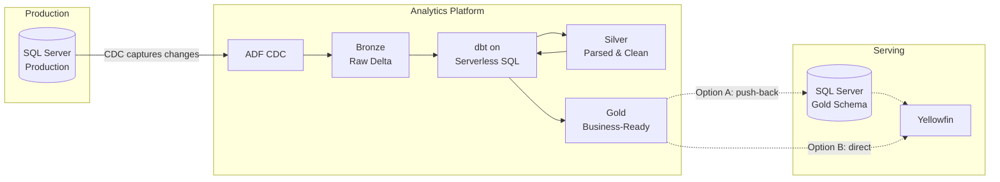

# 6clicks Data Architecture Roadmap

## 1. Current State

**What's Working:**
- dbt for transformations (team knows it well)
- Yellowfin with row-level tenant filtering
- Recent improvements: Analytics module breaking complex views into simpler, focused models

**Challenges:**
- Analytics queries run against production SQL Server -> performance impact
- Customer complaints due to slow reports (up to 25 minutes)
- Complex nested views with deep dependencies; hard to optimize piecemeal
- Business logic duplicated across many files (risk of inconsistency, maintenance burden)
- Migrating existing customers from old views is a bottleneck
- Small team stretched between delivery and architecture improvements

---

## 2. Gaps & Requirements

**Technical Gaps:**
- No layered data architecture; views built organically without clear separation of concerns
  - JSON parsing repeated in 8+ files, OPENJSON in 21 files
- No separation between operational and analytical workloads
- No incremental processing (full refreshes)

**Business Requirements:**
- Multi-region deployment (AU, UK, US, DE) with data residency
- Data freshness: near real-time for some, nightly for others
- Cost-efficient architecture that scales across regions
- GDPR compliance and data retention policies
- Data retention policies (?)

---

## 3. Guiding Principles

**Data:**
- No analytics queries hitting production
- No transformations on the operational database
- Serverless compute; pay for what we use
- Incremental loads; only process changed data
- Medallion architecture; only Gold layer available for reporting
  - **Bronze**: Raw CDC data, append-only, no transformations
  - **Silver**: Parse JSON once, explode arrays once, apply soft-delete filters
  - **Gold**: Business logic and denormalization only; simple tables, not 766-line views
- Privacy and Data Residency: Raw data can't leave the region

**Ways of Working:**
- One bite at a time; ship incremental improvements, not big-bang migrations
- Prefer managed services over self-hosted infrastructure
- Keep it simple; avoid over-engineering
- Observability first; logging, metrics, alerting from day one
- Infrastructure as code; all resources in version-controlled templates

---

## 4. Recommended Direction

**Target Architecture:**

**Key Benefits:**
- No heavy analytics load on production database  
- Serverless; no idle compute costs  
- Incremental; CDC captures only changes  
- Familiar tooling; dbt for transforms, ADF for orchestration  
- Yellowfin unchanged; still queries the same views

**Trade-offs:**
- 10-minute latency vs real-time views
- More moving parts (CDC + Delta + Databricks + push-back)
- Data duplication (Gold in Delta AND SQL Server)

---

## 5. Roadmap

### Phase 0: Quick Wins
- [ ] Push TenantId down all view layers; use in joins and filters everywhere

### Phase 1: POC (2-4 weeks)

- [ ] Single model, single region   
- [ ] Implement end-to-end  
- [ ] Pick something already implemented on Synapse (e.g. `vwQBA_QuestionAnswer`)  
      - Enables direct comparison of price and performance  
      - Fresh in team's memory

### Phase 2: Data Warehouse Setup (4-8 weeks)

- [ ] Multi-region from the start (AU, UK, US, DE)  
- [ ] CDC infrastructure and Delta Lake storage  
- [ ] Observability: logging, metrics, alerting  
- [ ] Security: access controls, data residency compliance  
- [ ] Infrastructure as code (reproducible across regions)
- [ ] Migration planning: time and resource estimation for full rollout

**Quick Wins (once infrastructure is up):**
- [ ] Point problematic/slow reports directly to data warehouse

### Phase 3: Module Migration (ongoing)

- [ ] Migrate modules one-by-one, all regions  
- [ ] Build out and refine medallion architecture as we go  
- [ ] Decommission old views as each module completes

---

## 6. Testing & Migration Strategy

**Data Model Review:**
- Conduct review of existing dbt models and Yellowfin views
- Produce high-level medallion design document:
  - **Bronze**: Raw CDC data, no transformations
  - **Silver**: JSON parsing, array explosion, soft-delete filtering, type casting; things done once for all downstream consumers
  - **Gold**: Business logic, denormalization, aggregations; what Yellowfin actually needs

**Migration Approach:**
- Yellowfin views remain untouched; they continue querying SQL Server as-is
- For each Yellowfin view, implement equivalent medallion models (Silver → Gold)
- Push Gold tables back to SQL Server reporting schema
- Cut over Yellowfin to new schema only when validated

**Automated Comparison Testing:**
- Build test harness that runs each Yellowfin view against both old and new data sources
- Compare row counts, sample values, and key metrics
- Generate discrepancy report highlighting mismatches (column diffs, missing rows, type issues)
- No migration without passing tests

---

## 7. Cost Estimate

**Cost Philosophy:**
- Costs should scale with load (serverless model)
- Near-zero for non-busy regions
- Manageable for busy regions

| Component | Monthly Cost |
|-----------|--------------|
| ADF CDC Resource | TBD |
| ADLS Storage (Delta) | TBD |
| Databricks Serverless SQL | TBD |
| ADF Orchestration | TBD |
| **Total per region** | **TBD** |

*Budget target: $250-1000/region*

---

## 8. Next Steps

1. Review and align on principles
2. Approve POC scope (which table, which region)
3. Allocate team capacity for Phase 0 + Phase 1

