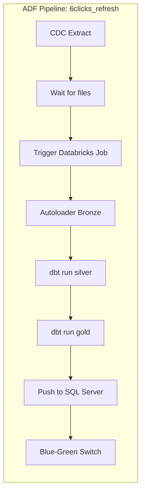

# Databricks PoC Implementation Plan

## Overview

Single-region proof of concept in **Australia East** with 5-10 source tables, designed for multi-region expansion.

```
┌─────────────────────────────────────────────────────────────────────────────┐
│                           Azure Subscription                                 │
│  ┌─────────────────┐    ┌─────────────────────────────────────────────────┐ │
│  │   Azure Data    │    │              Databricks Account                 │ │
│  │    Factory      │    │  ┌─────────┐  ┌─────────┐  ┌─────────┐         │ │
│  │                 │    │  │   DEV   │  │ STAGING │  │  PROD   │         │ │
│  │  CDC Pipelines  │    │  │Workspace│  │Workspace│  │Workspace│         │ │
│  └────────┬────────┘    │  └────┬────┘  └────┬────┘  └────┬────┘         │ │
│           │             │       │            │            │              │ │
│           ▼             │       └────────────┴────────────┘              │ │
│  ┌─────────────────┐    │                    │                           │ │
│  │      ADLS       │    │       ┌────────────▼────────────┐              │ │
│  │  Storage Acct   │◄───┼───────│     Unity Catalog       │              │ │
│  │                 │    │       │  ┌─────────────────┐    │              │ │
│  │ landing/        │    │       │  │   dev_catalog   │    │              │ │
│  │ unity-catalog/  │    │       │  │ staging_catalog │    │              │ │
│  └─────────────────┘    │       │  │  prod_catalog   │    │              │ │
│                         │       │  └─────────────────┘    │              │ │
│                         │       └─────────────────────────┘              │ │
│                         └─────────────────────────────────────────────────┘ │
└─────────────────────────────────────────────────────────────────────────────┘
```

---

## Responsibilities Matrix

| Task | Platform Team | Data Team |
|------|:-------------:|:---------:|
| **Infrastructure** | | |
| Azure subscription & resource groups | ✓ | |
| Terraform state backend (storage account) | ✓ | |
| Azure DevOps pipelines for Terraform | ✓ | |
| ADLS storage account + containers | ✓ | |
| Databricks account & workspaces | ✓ | |
| Unity Catalog metastore | ✓ | |
| Azure AD groups for RBAC | ✓ | |
| Private endpoints (future, not PoC) | ✓ | |
| **Data Layer** | | |
| Catalog & schema creation | | ✓ |
| ADF CDC pipelines | | ✓ |
| Autoloader jobs | | ✓ |
| dbt models (silver, gold) | | ✓ |
| Orchestration (ADF or Workflows) | | ✓ |
| Data quality checks | | ✓ |
| **Shared** | | |
| Access policies (who can access what) | ✓ | ✓ |
| Monitoring & alerting | ✓ | ✓ |

---

## PoC Architecture

### Storage Layout

```
Storage Account: st6clicksdata{env}aue
├── landing/                          # ADF writes here (external to Databricks)
│   ├── Answer/
│   │   └── 2024/01/15/1030/         # Partitioned by ingestion time
│   │       └── data.parquet
│   ├── Question/
│   ├── QuestionGroup/
│   └── ...
│
└── unity-catalog/                    # Managed by Unity Catalog
    ├── dev_catalog/
    ├── staging_catalog/
    └── prod_catalog/
```

### Catalog & Schema Structure

Each environment gets its own catalog:

```
dev_catalog
├── bronze_6clicks          # Raw ingested data (Delta)
│   ├── answer
│   ├── question
│   ├── question_group
│   └── ...
├── silver_6clicks          # Cleaned, parsed, deduplicated
│   ├── answer
│   ├── question_with_type_labels
│   └── ...
└── gold_6clicks            # Business-ready aggregates
    ├── qba_question_answer
    └── ...

staging_catalog             # Same structure
prod_catalog                # Same structure
```

---

## Phase 1: Platform Team Setup (Week 1)

### 1.1 Terraform State Backend

```hcl
# backend.tf
terraform {
  backend "azurerm" {
    resource_group_name  = "rg-terraform-state"
    storage_account_name = "stterraformstate6clicks"
    container_name       = "tfstate"
    key                  = "databricks-poc.tfstate"
  }
}
```

### 1.2 Resource Groups

```hcl
# Per environment
resource "azurerm_resource_group" "databricks" {
  for_each = toset(["dev", "staging", "prod"])
  name     = "rg-databricks-${each.key}-aue"
  location = "australiaeast"
}

resource "azurerm_resource_group" "data" {
  name     = "rg-data-aue"
  location = "australiaeast"
}
```

### 1.3 ADLS Storage Account

```hcl
resource "azurerm_storage_account" "data" {
  name                     = "st6clicksdataaue"
  resource_group_name      = azurerm_resource_group.data.name
  location                 = "australiaeast"
  account_tier             = "Standard"
  account_replication_type = "LRS"  # Use ZRS/GRS for prod
  is_hns_enabled           = true   # Required for ADLS Gen2

  blob_properties {
    delete_retention_policy {
      days = 7
    }
  }
}

resource "azurerm_storage_container" "landing" {
  name                  = "landing"
  storage_account_name  = azurerm_storage_account.data.name
  container_access_type = "private"
}

resource "azurerm_storage_container" "unity_catalog" {
  name                  = "unity-catalog"
  storage_account_name  = azurerm_storage_account.data.name
  container_access_type = "private"
}
```

### 1.4 Databricks Account & Workspaces

```hcl
# Unity Catalog requires account-level resources
resource "azurerm_databricks_workspace" "dev" {
  name                = "dbw-6clicks-dev-aue"
  resource_group_name = azurerm_resource_group.databricks["dev"].name
  location            = "australiaeast"
  sku                 = "premium"  # Required for Unity Catalog

  # Serverless = no managed VNET needed, simpler networking
}

resource "azurerm_databricks_workspace" "staging" {
  name                = "dbw-6clicks-staging-aue"
  resource_group_name = azurerm_resource_group.databricks["staging"].name
  location            = "australiaeast"
  sku                 = "premium"
}

resource "azurerm_databricks_workspace" "prod" {
  name                = "dbw-6clicks-prod-aue"
  resource_group_name = azurerm_resource_group.databricks["prod"].name
  location            = "australiaeast"
  sku                 = "premium"
}
```

### 1.5 Unity Catalog Metastore

```hcl
# Account-level resource (one per region)
resource "databricks_metastore" "aue" {
  provider      = databricks.account
  name          = "metastore-australiaeast"
  region        = "australiaeast"
  storage_root  = "abfss://unity-catalog@${azurerm_storage_account.data.name}.dfs.core.windows.net/"
  force_destroy = false
}

# Assign metastore to each workspace
resource "databricks_metastore_assignment" "dev" {
  provider     = databricks.account
  workspace_id = azurerm_databricks_workspace.dev.workspace_id
  metastore_id = databricks_metastore.aue.id
}

# Repeat for staging and prod
```

### 1.6 Azure AD Groups & RBAC

```hcl
# Create AD groups
resource "azuread_group" "data_engineers" {
  display_name     = "grp-databricks-data-engineers"
  security_enabled = true
}

resource "azuread_group" "data_analysts" {
  display_name     = "grp-databricks-data-analysts"
  security_enabled = true
}

resource "azuread_group" "platform_admins" {
  display_name     = "grp-databricks-platform-admins"
  security_enabled = true
}

# Sync groups to Databricks
resource "databricks_group" "data_engineers" {
  provider     = databricks.dev
  display_name = "data-engineers"
}
```

### 1.7 Access Connector for Unity Catalog

```hcl
# Managed identity for Unity Catalog to access ADLS
resource "azurerm_databricks_access_connector" "unity" {
  name                = "ac-unity-catalog-aue"
  resource_group_name = azurerm_resource_group.data.name
  location            = "australiaeast"

  identity {
    type = "SystemAssigned"
  }
}

# Grant access to storage
resource "azurerm_role_assignment" "unity_storage" {
  scope                = azurerm_storage_account.data.id
  role_definition_name = "Storage Blob Data Contributor"
  principal_id         = azurerm_databricks_access_connector.unity.identity[0].principal_id
}
```

---

## Phase 2: Data Team Setup (Week 2)

### 2.1 Create Catalogs & Schemas

```sql
-- Run in each workspace (or use Terraform databricks_catalog resource)

-- DEV workspace
CREATE CATALOG IF NOT EXISTS dev_catalog;
USE CATALOG dev_catalog;

CREATE SCHEMA IF NOT EXISTS bronze_6clicks;
CREATE SCHEMA IF NOT EXISTS silver_6clicks;
CREATE SCHEMA IF NOT EXISTS gold_6clicks;

-- Grant access
GRANT USE CATALOG ON CATALOG dev_catalog TO `data-engineers`;
GRANT USE SCHEMA ON SCHEMA bronze_6clicks TO `data-engineers`;
GRANT CREATE TABLE ON SCHEMA bronze_6clicks TO `data-engineers`;
-- ... similar for silver and gold
```

### 2.2 External Location for Landing Data

```sql
-- Allow Databricks to read from landing container
CREATE EXTERNAL LOCATION IF NOT EXISTS landing_aue
URL 'abfss://landing@st6clicksdataaue.dfs.core.windows.net/'
WITH (STORAGE CREDENTIAL unity_catalog_credential);

GRANT READ FILES ON EXTERNAL LOCATION landing_aue TO `data-engineers`;
```

### 2.3 Autoloader Bronze Ingestion

```python
# notebooks/bronze/ingest_answer.py

from pyspark.sql.functions import current_timestamp, input_file_name

source_path = "abfss://landing@st6clicksdataaue.dfs.core.windows.net/Answer/"
target_table = "dev_catalog.bronze_6clicks.answer"
checkpoint_path = "/Volumes/dev_catalog/bronze_6clicks/_checkpoints/answer"

# Autoloader with COPY INTO style (batch)
df = (spark.readStream
    .format("cloudFiles")
    .option("cloudFiles.format", "parquet")
    .option("cloudFiles.schemaLocation", checkpoint_path)
    .option("cloudFiles.inferColumnTypes", "true")
    .load(source_path)
    .withColumn("_ingested_at", current_timestamp())
    .withColumn("_source_file", input_file_name())
)

# Write to managed Delta table
(df.writeStream
    .format("delta")
    .option("checkpointLocation", checkpoint_path)
    .option("mergeSchema", "true")
    .trigger(availableNow=True)  # Process all available files, then stop
    .toTable(target_table)
)
```

### 2.4 Alternative: COPY INTO (Simpler)

```sql
-- Simpler batch approach, good for PoC
COPY INTO dev_catalog.bronze_6clicks.answer
FROM 'abfss://landing@st6clicksdataaue.dfs.core.windows.net/Answer/'
FILEFORMAT = PARQUET
FORMAT_OPTIONS ('mergeSchema' = 'true')
COPY_OPTIONS ('mergeSchema' = 'true');
```

### 2.5 dbt Project Structure

```
dbt_6clicks/
├── dbt_project.yml
├── profiles.yml
├── models/
│   ├── bronze/                    # Optional: can skip if using Autoloader
│   ├── silver/
│   │   ├── silver_answer.sql
│   │   ├── silver_question.sql
│   │   └── silver_question_with_types.sql
│   └── gold/
│       └── gold_qba_question_answer.sql
└── macros/
    └── risk_status_label.sql
```

```yaml
# dbt_project.yml
name: 'sixclicks'
version: '1.0.0'

profile: 'databricks'

model-paths: ["models"]

models:
  sixclicks:
    bronze:
      +materialized: view  # Just reference Autoloader tables
      +schema: bronze_6clicks
    silver:
      +materialized: incremental
      +schema: silver_6clicks
    gold:
      +materialized: table  # Full refresh for push-back
      +schema: gold_6clicks
```

---

## Phase 3: Orchestration (Week 3)

### 3.1 ADF Pipeline for Full Flow



### 3.2 Databricks Workflow (Alternative)

```yaml
# Can be created via Terraform or Databricks API
resources:
  jobs:
    sixclicks_refresh:
      name: "6clicks Data Refresh"
      schedule:
        quartz_cron_expression: "0 */10 * * * ?"  # Every 10 min
        timezone_id: "Australia/Sydney"
      
      tasks:
        - task_key: "bronze_ingest"
          notebook_task:
            notebook_path: "/Repos/6clicks/notebooks/bronze/ingest_all"
          job_cluster_key: "serverless"
        
        - task_key: "dbt_silver"
          depends_on:
            - task_key: "bronze_ingest"
          dbt_task:
            project_directory: "/Repos/6clicks/dbt_6clicks"
            commands:
              - "dbt run --select silver"
          job_cluster_key: "serverless"
        
        - task_key: "dbt_gold"
          depends_on:
            - task_key: "dbt_silver"
          dbt_task:
            project_directory: "/Repos/6clicks/dbt_6clicks"
            commands:
              - "dbt run --select gold"
          job_cluster_key: "serverless"
```

---

## Security Best Practices (PoC)

| Practice | PoC Implementation |
|----------|-------------------|
| **Identity** | Azure AD groups synced to Databricks |
| **Least privilege** | Data engineers: read bronze, write silver/gold |
| **Secrets** | Azure Key Vault for SQL Server credentials |
| **Network** | Public access OK for PoC; private endpoints for prod |
| **Audit** | Unity Catalog audit logs enabled |
| **Data** | No PII in PoC tables (use synthetic if needed) |

### Key Vault Integration

```hcl
resource "azurerm_key_vault" "databricks" {
  name                = "kv-databricks-aue"
  resource_group_name = azurerm_resource_group.data.name
  location            = "australiaeast"
  tenant_id           = data.azurerm_client_config.current.tenant_id
  sku_name            = "standard"
}

# Create Databricks secret scope backed by Key Vault
resource "databricks_secret_scope" "keyvault" {
  provider = databricks.dev
  name     = "keyvault-secrets"

  keyvault_metadata {
    resource_id = azurerm_key_vault.databricks.id
    dns_name    = azurerm_key_vault.databricks.vault_uri
  }
}
```

---

## Multi-Region Ready Design

PoC is single region, but designed for expansion:

```
                    ┌─────────────────────────────────────┐
                    │      Databricks Account (Global)    │
                    │                                     │
  Australia East    │   ┌─────────────────────────┐      │   US East
  ┌─────────────┐   │   │   Unity Catalog         │      │   ┌─────────────┐
  │ metastore-  │◄──┼───│   (Account Level)       │───┬──┼──►│ metastore-  │
  │ aue         │   │   │                         │   │  │   │ use         │
  └─────────────┘   │   └─────────────────────────┘   │  │   └─────────────┘
        │           │                                 │  │         │
        ▼           │                                 │  │         ▼
  ┌─────────────┐   │                                 │  │   ┌─────────────┐
  │ dev/stg/prod│   │                                 │  │   │ dev/stg/prod│
  │ workspaces  │   │                                 │  │   │ workspaces  │
  └─────────────┘   │                                 │  │   └─────────────┘
        │           │                                 │  │         │
        ▼           │                                 │  │         ▼
  ┌─────────────┐   │                                 │  │   ┌─────────────┐
  │ ADLS aue    │   │                                 │  │   │ ADLS use    │
  └─────────────┘   └─────────────────────────────────┘  │   └─────────────┘
```

**Key design decisions for multi-region:**
- One metastore per region (data stays local)
- Shared Databricks account for unified governance
- Same Terraform modules, different region variables
- Same dbt code deployed to each region

---

## Cost Estimate (PoC - Australia East)

| Component | Monthly Cost (AUD) |
|-----------|-------------------|
| Databricks workspaces (3x Premium) | $0 (pay per use) |
| Serverless SQL DBUs (~100 DBU-hrs @ $0.70) | ~$70 |
| ADLS Storage (100 GB) | ~$3 |
| ADF (100 pipeline runs) | ~$5 |
| Unity Catalog | Included in Premium |
| **Total PoC** | **~$80-100/month** |

---

## PoC Success Criteria

- [ ] All 3 workspaces provisioned via Terraform
- [ ] Unity Catalog with 3 catalogs (dev/staging/prod)
- [ ] 5-10 tables flowing through bronze → silver → gold
- [ ] Autoloader processing incremental parquet files
- [ ] dbt models running on serverless
- [ ] Azure AD groups controlling access
- [ ] End-to-end latency < 15 minutes
- [ ] Documentation for handover

---

## Azure DevOps Pipeline Structure

```yaml
# azure-pipelines.yml
trigger:
  branches:
    include:
      - main
  paths:
    include:
      - terraform/**

stages:
  - stage: Plan
    jobs:
      - job: TerraformPlan
        steps:
          - task: TerraformInstaller@0
            inputs:
              terraformVersion: '1.6.0'
          - task: TerraformTaskV4@4
            inputs:
              provider: 'azurerm'
              command: 'plan'
              workingDirectory: '$(System.DefaultWorkingDirectory)/terraform'

  - stage: Apply
    dependsOn: Plan
    condition: and(succeeded(), eq(variables['Build.SourceBranch'], 'refs/heads/main'))
    jobs:
      - deployment: TerraformApply
        environment: 'databricks-infrastructure'
        strategy:
          runOnce:
            deploy:
              steps:
                - task: TerraformTaskV4@4
                  inputs:
                    provider: 'azurerm'
                    command: 'apply'
                    workingDirectory: '$(System.DefaultWorkingDirectory)/terraform'
```

---

## Next Steps

1. **Platform Team** - Create Terraform repo, set up state backend
2. **Platform Team** - Run Phase 1 Terraform to provision infrastructure
3. **Data Team** - Create catalogs and schemas
4. **Data Team** - Build first Autoloader job for 1 table
5. **Data Team** - Build first dbt model (silver + gold)
6. **Both** - End-to-end test with sample data
7. **Both** - Document and handover

---

## References

- [Unity Catalog on Azure](https://learn.microsoft.com/en-us/azure/databricks/data-governance/unity-catalog/)
- [Terraform Databricks Provider](https://registry.terraform.io/providers/databricks/databricks/latest/docs)
- [Autoloader](https://docs.databricks.com/ingestion/auto-loader/index.html)
- [Serverless SQL Warehouses](https://docs.databricks.com/sql/admin/serverless.html)

