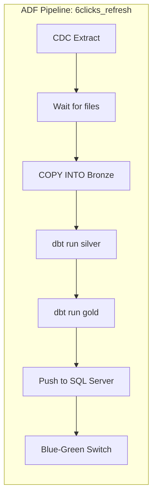

# Databricks PoC Implementation Plan

## Overview

Single-region proof of concept in **Australia East** with 5-10 source tables, designed for multi-region expansion.

```
┌─────────────────────────────────────────────────────────────────────────────┐
│                           Azure Subscription                                 │
│  ┌─────────────────┐    ┌─────────────────────────────────────────────────┐ │
│  │   Azure Data    │    │              Databricks Account                 │ │
│  │    Factory      │    │  ┌─────────┐  ┌─────────┐  ┌─────────┐         │ │
│  │                 │    │  │   DEV   │  │ STAGING │  │  PROD   │         │ │
│  │  CDC Pipelines  │    │  │Workspace│  │Workspace│  │Workspace│         │ │
│  └────────┬────────┘    │  └────┬────┘  └────┬────┘  └────┬────┘         │ │
│           │             │       │            │            │              │ │
│           ▼             │       └────────────┴────────────┘              │ │
│  ┌─────────────────┐    │                    │                           │ │
│  │      ADLS       │    │       ┌────────────▼────────────┐              │ │
│  │  Storage Acct   │◄───┼───────│     Unity Catalog       │              │ │
│  │                 │    │       │  ┌─────────────────┐    │              │ │
│  │ landing/        │    │       │  │   dev_catalog   │    │              │ │
│  │ unity-catalog/  │    │       │  │ staging_catalog │    │              │ │
│  └─────────────────┘    │       │  │  prod_catalog   │    │              │ │
│                         │       │  └─────────────────┘    │              │ │
│                         │       └─────────────────────────┘              │ │
│                         └─────────────────────────────────────────────────┘ │
└─────────────────────────────────────────────────────────────────────────────┘
```

---

## Responsibilities Matrix

| Task | Platform Team | Data Team |
|------|:-------------:|:---------:|
| **Infrastructure** | | |
| Azure subscription & resource groups | ✓ | |
| Terraform state backend (storage account) | ✓ | |
| Azure DevOps pipelines for Terraform | ✓ | |
| ADLS storage account + containers | ✓ | |
| Databricks account & workspaces | ✓ | |
| Unity Catalog metastore | ✓ | |
| Azure AD groups for RBAC | ✓ | |
| Private endpoints (future, not PoC) | ✓ | |
| **Data Layer** | | |
| Catalog & schema creation | | ✓ |
| Bronze external tables | | ✓ |
| ADF CDC pipelines | | ✓ |
| dbt models (silver, gold) | | ✓ |
| Orchestration (ADF or Azure DevOps) | | ✓ |
| Data quality checks | | ✓ |
| **Shared** | | |
| Access policies (who can access what) | ✓ | ✓ |
| Monitoring & alerting | ✓ | ✓ |

---

## PoC Architecture

### Storage Layout

```
Storage Account: st6clicksdata{env}aue
├── landing/                          # ADF writes here (external to Databricks)
│   ├── Answer/
│   │   └── 2024/01/15/1030/         # Partitioned by ingestion time
│   │       └── data.parquet
│   ├── Question/
│   ├── QuestionGroup/
│   └── ...
│
└── unity-catalog/                    # Managed by Unity Catalog
    ├── dev_catalog/
    ├── staging_catalog/
    └── prod_catalog/
```

### Catalog & Schema Structure

Each environment gets its own catalog:

```
dev_catalog
├── bronze_6clicks          # External tables (Parquet from landing)
│   ├── answer              # → reads from landing/Answer/
│   ├── question            # → reads from landing/Question/
│   ├── question_group      # → reads from landing/QuestionGroup/
│   └── ...
├── silver_6clicks          # Managed Delta tables (cleaned, parsed)
│   ├── answer
│   ├── question_with_type_labels
│   └── ...
└── gold_6clicks            # Managed Delta tables (business-ready)
    ├── qba_question_answer
    └── ...

staging_catalog             # Same structure
prod_catalog                # Same structure
```

---

## Phase 1: Platform Team Setup (Week 1)

### 1.1 Terraform State Backend

```hcl
# backend.tf
terraform {
  backend "azurerm" {
    resource_group_name  = "rg-terraform-state"
    storage_account_name = "stterraformstate6clicks"
    container_name       = "tfstate"
    key                  = "databricks-poc.tfstate"
  }
}
```

### 1.2 Resource Groups

```hcl
# Per environment
resource "azurerm_resource_group" "databricks" {
  for_each = toset(["dev", "staging", "prod"])
  name     = "rg-databricks-${each.key}-aue"
  location = "australiaeast"
}

resource "azurerm_resource_group" "data" {
  name     = "rg-data-aue"
  location = "australiaeast"
}
```

### 1.3 ADLS Storage Account

```hcl
resource "azurerm_storage_account" "data" {
  name                     = "st6clicksdataaue"
  resource_group_name      = azurerm_resource_group.data.name
  location                 = "australiaeast"
  account_tier             = "Standard"
  account_replication_type = "LRS"  # Use ZRS/GRS for prod
  is_hns_enabled           = true   # Required for ADLS Gen2

  blob_properties {
    delete_retention_policy {
      days = 7
    }
  }
}

resource "azurerm_storage_container" "landing" {
  name                  = "landing"
  storage_account_name  = azurerm_storage_account.data.name
  container_access_type = "private"
}

resource "azurerm_storage_container" "unity_catalog" {
  name                  = "unity-catalog"
  storage_account_name  = azurerm_storage_account.data.name
  container_access_type = "private"
}
```

### 1.4 Databricks Account & Workspaces

```hcl
# Unity Catalog requires account-level resources
resource "azurerm_databricks_workspace" "dev" {
  name                = "dbw-6clicks-dev-aue"
  resource_group_name = azurerm_resource_group.databricks["dev"].name
  location            = "australiaeast"
  sku                 = "premium"  # Required for Unity Catalog

  # Serverless = no managed VNET needed, simpler networking
}

resource "azurerm_databricks_workspace" "staging" {
  name                = "dbw-6clicks-staging-aue"
  resource_group_name = azurerm_resource_group.databricks["staging"].name
  location            = "australiaeast"
  sku                 = "premium"
}

resource "azurerm_databricks_workspace" "prod" {
  name                = "dbw-6clicks-prod-aue"
  resource_group_name = azurerm_resource_group.databricks["prod"].name
  location            = "australiaeast"
  sku                 = "premium"
}
```

### 1.5 Unity Catalog Metastore

```hcl
# Account-level resource (one per region)
resource "databricks_metastore" "aue" {
  provider      = databricks.account
  name          = "metastore-australiaeast"
  region        = "australiaeast"
  storage_root  = "abfss://unity-catalog@${azurerm_storage_account.data.name}.dfs.core.windows.net/"
  force_destroy = false
}

# Assign metastore to each workspace
resource "databricks_metastore_assignment" "dev" {
  provider     = databricks.account
  workspace_id = azurerm_databricks_workspace.dev.workspace_id
  metastore_id = databricks_metastore.aue.id
}

# Repeat for staging and prod
```

### 1.6 Azure AD Groups & RBAC

```hcl
# Create AD groups
resource "azuread_group" "data_engineers" {
  display_name     = "grp-databricks-data-engineers"
  security_enabled = true
}

resource "azuread_group" "data_analysts" {
  display_name     = "grp-databricks-data-analysts"
  security_enabled = true
}

resource "azuread_group" "platform_admins" {
  display_name     = "grp-databricks-platform-admins"
  security_enabled = true
}

# Sync groups to Databricks
resource "databricks_group" "data_engineers" {
  provider     = databricks.dev
  display_name = "data-engineers"
}
```

### 1.7 Access Connector for Unity Catalog

```hcl
# Managed identity for Unity Catalog to access ADLS
resource "azurerm_databricks_access_connector" "unity" {
  name                = "ac-unity-catalog-aue"
  resource_group_name = azurerm_resource_group.data.name
  location            = "australiaeast"

  identity {
    type = "SystemAssigned"
  }
}

# Grant access to storage
resource "azurerm_role_assignment" "unity_storage" {
  scope                = azurerm_storage_account.data.id
  role_definition_name = "Storage Blob Data Contributor"
  principal_id         = azurerm_databricks_access_connector.unity.identity[0].principal_id
}
```

---

## Phase 2: Data Team Setup (Week 2)

### 2.1 Create Catalogs & Schemas

```sql
-- Run in each workspace (or use Terraform databricks_catalog resource)

-- DEV workspace
CREATE CATALOG IF NOT EXISTS dev_catalog;
USE CATALOG dev_catalog;

CREATE SCHEMA IF NOT EXISTS bronze_6clicks;
CREATE SCHEMA IF NOT EXISTS silver_6clicks;
CREATE SCHEMA IF NOT EXISTS gold_6clicks;

-- Grant access
GRANT USE CATALOG ON CATALOG dev_catalog TO `data-engineers`;
GRANT USE SCHEMA ON SCHEMA bronze_6clicks TO `data-engineers`;
GRANT CREATE TABLE ON SCHEMA bronze_6clicks TO `data-engineers`;
-- ... similar for silver and gold
```

### 2.2 External Location for Landing Data

```sql
-- Allow Databricks to read from landing container
CREATE EXTERNAL LOCATION IF NOT EXISTS landing_aue
URL 'abfss://landing@st6clicksdataaue.dfs.core.windows.net/'
WITH (STORAGE CREDENTIAL unity_catalog_credential);

GRANT READ FILES ON EXTERNAL LOCATION landing_aue TO `data-engineers`;
```

### 2.3 Bronze Layer: External Tables

For PoC, bronze layer uses **external tables** pointing directly to landing parquet files. No data movement, no extra storage cost.

```sql
-- Create external table pointing to ADF landing data
CREATE TABLE IF NOT EXISTS dev_catalog.bronze_6clicks.answer
USING PARQUET
LOCATION 'abfss://landing@st6clicksdataaue.dfs.core.windows.net/Answer/';

-- Refresh metadata when new files arrive
MSCK REPAIR TABLE dev_catalog.bronze_6clicks.answer;
```

**Alternative: COPY INTO (if you want managed Delta tables)**

```sql
-- Copies data into managed Delta table with incremental file tracking
COPY INTO dev_catalog.bronze_6clicks.answer
FROM 'abfss://landing@st6clicksdataaue.dfs.core.windows.net/Answer/'
FILEFORMAT = PARQUET
FORMAT_OPTIONS ('mergeSchema' = 'true')
COPY_OPTIONS ('mergeSchema' = 'true');
```

**Trade-offs:**

| Approach | Pros | Cons |
|----------|------|------|
| External tables | No data duplication, simple | No Delta features, schema changes need DDL |
| COPY INTO | Delta benefits, auto-schema merge | Extra storage, small compute cost |

**Recommendation for PoC:** Start with external tables. Move to COPY INTO if you need Delta features like time travel or merge.

### 2.4 dbt Project Structure

```
dbt_6clicks/
├── dbt_project.yml
├── profiles.yml
├── models/
│   ├── staging/                   # References bronze external tables
│   │   └── stg_answer.sql
│   ├── silver/                    # Managed Delta tables
│   │   ├── silver_answer.sql
│   │   ├── silver_question.sql
│   │   └── silver_question_with_types.sql
│   └── gold/                      # Managed Delta tables
│       └── gold_qba_question_answer.sql
└── macros/
    └── risk_status_label.sql
```

```yaml
# dbt_project.yml
name: 'sixclicks'
version: '1.0.0'

profile: 'databricks'

model-paths: ["models"]

models:
  sixclicks:
    staging:
      +materialized: view           # Just reference bronze external tables
      +schema: bronze_6clicks
    silver:
      +materialized: incremental    # Managed Delta with incremental
      +schema: silver_6clicks
      +incremental_strategy: merge
      +unique_key: id
    gold:
      +materialized: table          # Full refresh for push-back
      +schema: gold_6clicks
```

```yaml
# profiles.yml
databricks:
  target: dev
  outputs:
    dev:
      type: databricks
      catalog: dev_catalog
      schema: silver_6clicks
      host: "{{ env_var('DATABRICKS_HOST') }}"
      http_path: /sql/1.0/warehouses/xxxxx  # dbt warehouse ID
      token: "{{ env_var('DATABRICKS_TOKEN') }}"
```

---

## Phase 3: Orchestration (Week 3)

### Scheduling Options for dbt

| Option | Pros | Cons |
|--------|------|------|
| **Azure Data Factory** | Already in stack for CDC, visual UI, built-in monitoring | Overkill for just dbt scheduling |
| **Azure DevOps Pipelines** | Familiar to team, good for CI/CD + scheduling | Needs agent/container setup |
| **GitHub Actions** | Simple YAML, free tier available | May need to migrate repos |

**Recommendation:** Use **Azure Data Factory** for the full pipeline (CDC → dbt → push-back) since it's already orchestrating CDC. Single tool for all orchestration.

### 3.1 ADF Pipeline for Full Flow



### 3.2 ADF + dbt Integration

ADF can run dbt in two ways:

**Option A: Azure Container Instance (Recommended for PoC)**

```json
{
  "name": "dbt_run_activity",
  "type": "AzureContainerInstance",
  "typeProperties": {
    "image": "ghcr.io/dbt-labs/dbt-databricks:latest",
    "command": ["dbt", "run", "--profiles-dir", "/profiles"],
    "environmentVariables": {
      "DATABRICKS_HOST": "@pipeline().parameters.databricks_host",
      "DATABRICKS_TOKEN": "@pipeline().parameters.databricks_token"
    }
  }
}
```

**Option B: Azure DevOps Scheduled Pipeline**

```yaml
# azure-pipelines-dbt.yml
trigger: none

schedules:
  - cron: "0 * * * *"  # Every hour
    displayName: "Hourly dbt run"
    branches:
      include:
        - main
    always: true

pool:
  vmImage: 'ubuntu-latest'

steps:
  - task: UsePythonVersion@0
    inputs:
      versionSpec: '3.10'

  - script: |
      pip install dbt-databricks
      cd dbt_6clicks
      dbt run --target prod
    displayName: 'Run dbt'
    env:
      DATABRICKS_HOST: $(DATABRICKS_HOST)
      DATABRICKS_TOKEN: $(DATABRICKS_TOKEN)
```

### 3.3 Serverless SQL Warehouse Configuration

```hcl
# Two separate warehouses for isolation
resource "databricks_sql_endpoint" "dbt" {
  name             = "dbt-processing"
  cluster_size     = "2X-Small"
  max_num_clusters = 1
  auto_stop_mins   = 1
  
  warehouse_type   = "PRO"  # Required for serverless
  enable_serverless_compute = true
  
  tags {
    custom_tags {
      key   = "purpose"
      value = "dbt"
    }
  }
}

resource "databricks_sql_endpoint" "yellowfin" {
  name             = "yellowfin-serving"
  cluster_size     = "2X-Small"
  max_num_clusters = 1
  auto_stop_mins   = 1  # Scale to zero quickly
  
  warehouse_type   = "PRO"
  enable_serverless_compute = true
  
  tags {
    custom_tags {
      key   = "purpose"
      value = "yellowfin"
    }
  }
}

---

## Security Best Practices (PoC)

| Practice | PoC Implementation |
|----------|-------------------|
| **Identity** | Azure AD groups synced to Databricks |
| **Least privilege** | Data engineers: read bronze, write silver/gold |
| **Secrets** | Azure Key Vault for SQL Server credentials |
| **Network** | Public access OK for PoC; private endpoints for prod |
| **Audit** | Unity Catalog audit logs enabled |
| **Data** | No PII in PoC tables (use synthetic if needed) |

### Key Vault Integration

```hcl
resource "azurerm_key_vault" "databricks" {
  name                = "kv-databricks-aue"
  resource_group_name = azurerm_resource_group.data.name
  location            = "australiaeast"
  tenant_id           = data.azurerm_client_config.current.tenant_id
  sku_name            = "standard"
}

# Create Databricks secret scope backed by Key Vault
resource "databricks_secret_scope" "keyvault" {
  provider = databricks.dev
  name     = "keyvault-secrets"

  keyvault_metadata {
    resource_id = azurerm_key_vault.databricks.id
    dns_name    = azurerm_key_vault.databricks.vault_uri
  }
}
```

---

## Multi-Region Ready Design

PoC is single region, but designed for expansion:

```
                    ┌─────────────────────────────────────┐
                    │      Databricks Account (Global)    │
                    │                                     │
  Australia East    │   ┌─────────────────────────┐      │   US East
  ┌─────────────┐   │   │   Unity Catalog         │      │   ┌─────────────┐
  │ metastore-  │◄──┼───│   (Account Level)       │───┬──┼──►│ metastore-  │
  │ aue         │   │   │                         │   │  │   │ use         │
  └─────────────┘   │   └─────────────────────────┘   │  │   └─────────────┘
        │           │                                 │  │         │
        ▼           │                                 │  │         ▼
  ┌─────────────┐   │                                 │  │   ┌─────────────┐
  │ dev/stg/prod│   │                                 │  │   │ dev/stg/prod│
  │ workspaces  │   │                                 │  │   │ workspaces  │
  └─────────────┘   │                                 │  │   └─────────────┘
        │           │                                 │  │         │
        ▼           │                                 │  │         ▼
  ┌─────────────┐   │                                 │  │   ┌─────────────┐
  │ ADLS aue    │   │                                 │  │   │ ADLS use    │
  └─────────────┘   └─────────────────────────────────┘  │   └─────────────┘
```

**Key design decisions for multi-region:**
- One metastore per region (data stays local)
- Shared Databricks account for unified governance
- Same Terraform modules, different region variables
- Same dbt code deployed to each region

---

## Cost Estimate (PoC - Australia East)

### Executive Summary

| Component | Monthly Cost (USD) |
|-----------|-------------------|
| dbt Serverless SQL Warehouse (2X-Small) | ~$90 |
| Yellowfin Serverless SQL Warehouse (2X-Small) | ~$80 |
| ADLS Storage (100 GB) | ~$3 |
| ADF Pipeline Runs | ~$5 |
| Unity Catalog | Included |
| **Total PoC** | **~$180/month** |

---

### Detailed Cost Breakdown

This section provides a transparent breakdown of how costs were calculated.

#### Serverless SQL Warehouse Pricing (from Databricks)

| Size | DBUs | Hourly Cost |
|------|------|-------------|
| 2X-Small | 4 | $3.80 |
| X-Small | 6 | $5.70 |
| Small | 12 | $11.40 |
| Medium | 24 | $22.80 |

#### Assumptions

| Parameter | Value | Notes |
|-----------|-------|-------|
| dbt run frequency | Every hour (24/day) | Processes silver + gold layers |
| dbt run duration | 2 minutes | Minimal data volume |
| dbt warehouse size | 2X-Small | $3.80/hour |
| Yellowfin queries/day | ~100 (weekdays) | Minimal on weekends |
| Yellowfin session duration | ~2 min | Includes startup + query + idle |
| Yellowfin warehouse size | 2X-Small | $3.80/hour |
| Region | Australia East | |

#### 1. dbt Processing Warehouse (2X-Small)

```
Daily runtime:     24 runs × 2 min = 48 min = 0.8 hours/day
Monthly runtime:   0.8 hours × 30 days = 24 hours/month
Hourly rate:       $3.80/hour
Monthly cost:      24 × $3.80 = $91 ≈ $90
```

**Key point:** Serverless SQL Warehouses scale to zero when idle. You only pay for the 2 minutes each hour when dbt is actually running.

#### 2. Yellowfin Serving Warehouse (2X-Small)

```
Weekday usage:     100 queries × ~2 min session = ~50 min/day
Weekend usage:     Minimal, ~10 min/day
Monthly runtime:   (22 weekdays × 50 min) + (8 weekend days × 10 min)
                 = 1100 + 80 = 1180 min = ~20 hours/month
Hourly rate:       $3.80/hour
Monthly cost:      20 × $3.80 = $76 ≈ $80
```

**Key point:** Serverless scales to zero between queries. Weekend usage is minimal. Most queries are batched during business hours.

#### 3. Storage & Other

| Item | Calculation | Cost |
|------|-------------|------|
| ADLS Gen2 (Hot tier) | 100 GB × $0.023/GB | ~$3/month |
| ADF Pipeline runs | ~700 runs × $0.001 | ~$1/month |
| ADF Activity runs | ~2100 activities × $0.00001 | ~$0.02/month |
| Unity Catalog | Included in Premium | $0 |

#### Cost Scaling Considerations

| Scenario | Impact |
|----------|--------|
| Increase dbt frequency to every 10 min | 6× more runs, but similar total runtime if each run is faster |
| Add more regions | Linear cost increase per region |
| Larger data volumes | May need larger warehouses or longer runtimes |
| Reduce Yellowfin usage | Direct cost reduction |

#### What's NOT Included

- Egress charges (minimal for same-region)
- Azure DevOps (likely covered by existing subscription)
- Team time for development

---

## PoC Success Criteria

- [ ] All 3 workspaces provisioned via Terraform
- [ ] Unity Catalog with 3 catalogs (dev/staging/prod)
- [ ] 5-10 tables flowing through bronze → silver → gold
- [ ] Bronze layer as external tables reading ADF landing data
- [ ] Silver/gold as managed Delta tables
- [ ] dbt running on 2X-Small Serverless SQL Warehouse
- [ ] Yellowfin connected to 2X-Small Serverless SQL Warehouse
- [ ] Azure AD groups controlling access
- [ ] Hourly dbt runs scheduled (ADF or Azure DevOps)
- [ ] End-to-end latency < 15 minutes
- [ ] Documentation for handover

---

## Azure DevOps Pipeline Structure

### Infrastructure CI/CD (Terraform)

```yaml
# azure-pipelines-infra.yml
trigger:
  branches:
    include:
      - main
  paths:
    include:
      - terraform/**

stages:
  - stage: Plan
    jobs:
      - job: TerraformPlan
        steps:
          - task: TerraformInstaller@0
            inputs:
              terraformVersion: '1.6.0'
          - task: TerraformTaskV4@4
            inputs:
              provider: 'azurerm'
              command: 'plan'
              workingDirectory: '$(System.DefaultWorkingDirectory)/terraform'

  - stage: Apply
    dependsOn: Plan
    condition: and(succeeded(), eq(variables['Build.SourceBranch'], 'refs/heads/main'))
    jobs:
      - deployment: TerraformApply
        environment: 'databricks-infrastructure'
        strategy:
          runOnce:
            deploy:
              steps:
                - task: TerraformTaskV4@4
                  inputs:
                    provider: 'azurerm'
                    command: 'apply'
                    workingDirectory: '$(System.DefaultWorkingDirectory)/terraform'
```

### dbt Code CI/CD

```yaml
# azure-pipelines-dbt-ci.yml
trigger:
  branches:
    include:
      - main
      - feature/*
  paths:
    include:
      - dbt_6clicks/**

pool:
  vmImage: 'ubuntu-latest'

stages:
  - stage: Test
    jobs:
      - job: dbtTest
        steps:
          - task: UsePythonVersion@0
            inputs:
              versionSpec: '3.10'
          - script: |
              pip install dbt-databricks
              cd dbt_6clicks
              dbt deps
              dbt compile --target dev
            displayName: 'Compile dbt models'

  - stage: Deploy
    condition: eq(variables['Build.SourceBranch'], 'refs/heads/main')
    jobs:
      - deployment: DeployDbt
        environment: 'databricks-dev'
        strategy:
          runOnce:
            deploy:
              steps:
                - script: |
                    # Sync dbt project to Databricks Repos or DBFS
                    echo "Deploying dbt project..."
                  displayName: 'Deploy dbt to Databricks'
```

---

## Next Steps

1. **Platform Team** - Create Terraform repo, set up state backend
2. **Platform Team** - Run Phase 1 Terraform to provision infrastructure
3. **Data Team** - Create catalogs and schemas
4. **Data Team** - Build first Autoloader job for 1 table
5. **Data Team** - Build first dbt model (silver + gold)
6. **Both** - End-to-end test with sample data
7. **Both** - Document and handover

---

---

## Alternate Plan: Autoloader + Materialized Views

This plan prioritizes **cost efficiency** with scheduled batch runs instead of streaming.

### Architecture

```
ADF CDC → Parquet → ADLS Landing
                        │
                        ▼ (Event Grid notifies)
              ┌─────────────────────┐
              │   Azure Event Grid  │ ← Blob created events
              └─────────┬───────────┘
                        │
                        ▼ (Queue stores events)
              ┌─────────────────────┐
              │  Storage Queue or   │ ← Accumulates file notifications
              │    Service Bus      │
              └─────────┬───────────┘
                        │
                        ▼ (Scheduled job processes queue)
              ┌─────────────────────────────────────────┐
              │  Databricks Job (Scheduled, e.g. hourly) │
              │  ┌─────────────────────────────────────┐ │
              │  │  Autoloader (cloudFiles)            │ │
              │  │  reads Parquet → writes Delta       │ │
              │  └─────────────────────────────────────┘ │
              │                   │                      │
              │                   ▼                      │
              │  ┌─────────────────────────────────────┐ │
              │  │  Bronze (Delta Tables)              │ │
              │  │  Append-only, raw data              │ │
              │  └─────────────────────────────────────┘ │
              │                   │                      │
              │                   ▼                      │
              │  ┌─────────────────────────────────────┐ │
              │  │  Materialized Views (Silver/Gold)   │ │
              │  │  Auto-refresh after Bronze updated  │ │
              │  └─────────────────────────────────────┘ │
              └─────────────────────────────────────────┘
```

### File Notification: Azure Event Grid

Azure Event Grid is the Azure equivalent of AWS SQS/SNS for event-driven architectures. When a new parquet file lands in ADLS, Event Grid can notify you.

**Setup:**

```hcl
# Event Grid subscription for blob created events
resource "azurerm_eventgrid_event_subscription" "blob_created" {
  name  = "new-parquet-files"
  scope = azurerm_storage_account.data.id

  included_event_types = ["Microsoft.Storage.BlobCreated"]

  subject_filter {
    subject_begins_with = "/blobServices/default/containers/landing/"
    subject_ends_with   = ".parquet"
  }

  # Option 1: Storage Queue (simpler, cheaper)
  storage_queue_endpoint {
    storage_account_id = azurerm_storage_account.data.id
    queue_name         = "new-files"
  }

  # Option 2: Service Bus (more features)
  # service_bus_queue_endpoint_id = azurerm_servicebus_queue.new_files.id
}
```

**How Autoloader uses this:** Autoloader has a "file notification mode" that subscribes directly to Event Grid. No need for a separate queue—Autoloader handles it:

```python
df = (spark.readStream
    .format("cloudFiles")
    .option("cloudFiles.format", "parquet")
    .option("cloudFiles.useNotifications", "true")  # Uses Event Grid
    .option("cloudFiles.subscriptionId", "<subscription-id>")
    .option("cloudFiles.tenantId", "<tenant-id>")
    .option("cloudFiles.clientId", "<service-principal-client-id>")
    .option("cloudFiles.clientSecret", dbutils.secrets.get("keyvault", "sp-secret"))
    .option("cloudFiles.resourceGroup", "rg-data-aue")
    .load("abfss://landing@st6clicksdataaue.dfs.core.windows.net/Answer/"))
```

**Trade-off:** File notification mode requires a service principal with Event Grid permissions. For PoC, directory listing mode is simpler.

### Autoloader Does NOT Support Merge

**Autoloader is append-only.** It tracks which files have been processed and appends new records to the Delta table. It does not:
- Deduplicate
- Update existing records
- Handle CDC merge semantics

**For SCD/Merge, you need a two-step pattern:**

```python
# Step 1: Autoloader appends to a staging table (Bronze)
(spark.readStream
    .format("cloudFiles")
    .option("cloudFiles.format", "parquet")
    .option("cloudFiles.schemaLocation", "/checkpoints/answer_schema")
    .load("abfss://landing@st6clicksdataaue.dfs.core.windows.net/Answer/")
    .writeStream
    .option("checkpointLocation", "/checkpoints/answer")
    .trigger(availableNow=True)  # Scheduled batch, not continuous streaming
    .toTable("bronze_6clicks.answer_raw"))

# Step 2: Separate job merges into Silver (using MERGE INTO or dbt incremental)
```

### Scheduled Autoloader (Cost-Optimized)

Instead of running Autoloader continuously (streaming), use **Trigger.AvailableNow** for scheduled batch processing:

```python
# This processes all available files, then stops
# Perfect for hourly/daily scheduled runs
(spark.readStream
    .format("cloudFiles")
    .option("cloudFiles.format", "parquet")
    .option("cloudFiles.schemaLocation", "/checkpoints/schema/answer")
    .load("abfss://landing@st6clicksdataaue.dfs.core.windows.net/Answer/")
    .writeStream
    .format("delta")
    .option("checkpointLocation", "/checkpoints/answer")
    .trigger(availableNow=True)  # ← KEY: processes batch then exits
    .toTable("dev_catalog.bronze_6clicks.answer"))
```

**Cost comparison (Jobs Compute Serverless @ ~$0.40/DBU, much cheaper than SQL Warehouse):**

| Mode | Cluster Runtime | Monthly Cost |
|------|-----------------|--------------|
| Streaming (always on) | 720 hours | $1,150+ |
| Scheduled hourly (5 min/run) | 60 hours | ~$95 |
| Scheduled hourly (2 min/run) | 24 hours | ~$40 |

### Materialized Views on Bronze

**⚠️ Important:** Materialized View refresh runs on **SQL Warehouse** (not Jobs Compute), so it's more expensive (~$0.70/DBU vs $0.40/DBU). For cost-sensitive workloads, consider **Delta Live Tables (DLT)** instead—DLT runs on Jobs Compute pricing.

Once Bronze Delta tables exist, create materialized views for Silver/Gold:

```sql
-- Silver: cleaned, typed, deduped
CREATE MATERIALIZED VIEW dev_catalog.silver_6clicks.answer
AS
SELECT
    Id,
    QuestionId,
    TenantId,
    Score,
    RiskStatus,
    CASE RiskStatus
        WHEN 0 THEN 'No Risk'
        WHEN 1 THEN 'Low Risk'
        WHEN 3 THEN 'Medium Risk'
        WHEN 4 THEN 'High Risk'
        WHEN 5 THEN 'Very High Risk'
        WHEN 6 THEN 'Very Low Risk'
        ELSE 'Undefined'
    END AS RiskStatusCode,
    Compliance,
    ComponentStr,
    coalesce(LastModificationTime, CreationTime) AS UpdateTime
FROM dev_catalog.bronze_6clicks.answer
WHERE IsDeleted = 0 AND Status = 3
QUALIFY ROW_NUMBER() OVER (PARTITION BY Id ORDER BY _rescued_data DESC) = 1;

-- Gold: business-ready aggregation (e.g., QBA Question Answer)
CREATE MATERIALIZED VIEW dev_catalog.gold_6clicks.qba_question_answer
AS
-- Databricks-compatible version of vwQBA_QuestionAnswer
SELECT ...
FROM dev_catalog.silver_6clicks.answer a
JOIN dev_catalog.silver_6clicks.question q ON ...
```

### Materialized View Refresh Options

```sql
-- Manual refresh (for scheduled jobs)
REFRESH MATERIALIZED VIEW dev_catalog.silver_6clicks.answer;

-- Scheduled refresh (built-in)
ALTER MATERIALIZED VIEW dev_catalog.silver_6clicks.answer
SET TBLPROPERTIES ('schedule' = 'INTERVAL 1 HOUR');
```

### End-to-End Scheduled Pipeline

```
┌──────────────────────────────────────────────────────────────────┐
│  ADF Pipeline: 6clicks_scheduled_refresh (runs hourly)          │
│                                                                  │
│  1. [CDC Extract] → ADF copies changed rows to Parquet landing  │
│                                                                  │
│  2. [Databricks Job] → Autoloader (availableNow)                │
│     - Answer, Question, QuestionGroup, QuestionGroupResponse    │
│     - Appends to Bronze Delta tables                            │
│                                                                  │
│  3. [Databricks SQL] → REFRESH MATERIALIZED VIEW (Silver)       │
│                                                                  │
│  4. [Databricks SQL] → REFRESH MATERIALIZED VIEW (Gold)         │
│                                                                  │
│  5. [Optional] → Push Gold to SQL Server for Yellowfin          │
└──────────────────────────────────────────────────────────────────┘
```

### Cost Estimate (Alternate Plan)

**Compute pricing (Azure, approximate):**

| Compute Type | $/DBU | Use Case |
|--------------|-------|----------|
| Jobs Compute Serverless | ~$0.40 | Autoloader, DLT, Spark jobs |
| SQL Warehouse Serverless | ~$0.70 | Queries, MV refresh |
| Classic Jobs (with clusters) | ~$0.22 | Cheapest, but startup latency |

**Option A: Autoloader + Materialized Views**

| Component | Compute | Calculation | Monthly Cost |
|-----------|---------|-------------|--------------|
| Autoloader Job (hourly, 2 min) | Jobs Compute | 24 hrs × ~$1.60/hr | ~$40 |
| MV Refresh (hourly, 3 min) | SQL Warehouse | 36 hrs × $3.80/hr | ~$135 |
| Storage (Bronze Delta) | — | +50 GB | ~$2 |
| Event Grid | — | 10K events | ~$0.01 |
| **Total** | | | **~$180/month** |

**Option B: Autoloader + Delta Live Tables (cheapest)**

DLT uses Jobs Compute pricing for both ingestion AND transformations:

| Component | Compute | Calculation | Monthly Cost |
|-----------|---------|-------------|--------------|
| DLT Pipeline (hourly, 5 min) | Jobs Compute | 60 hrs × ~$1.60/hr | ~$95 |
| Storage (Bronze + Silver Delta) | — | +100 GB | ~$3 |
| Event Grid | — | 10K events | ~$0.01 |
| **Total** | | | **~$100/month** |

**vs. Current Plan (External Tables + dbt on SQL Warehouse @ ~$180/month):**
- Option A (Autoloader + MV): Similar cost, but gains Delta features in Bronze
- Option B (Autoloader + DLT): **~45% cheaper**, all on Jobs Compute pricing

### Delta Live Tables (DLT) Alternative

DLT is Databricks' declarative ETL framework. It runs on **Jobs Compute** (cheaper) and handles both ingestion and transformations:

```python
# DLT notebook - entire pipeline in one file
import dlt
from pyspark.sql.functions import *

# Bronze: Autoloader ingestion
@dlt.table(comment="Raw answers from landing")
def bronze_answer():
    return (spark.readStream
        .format("cloudFiles")
        .option("cloudFiles.format", "parquet")
        .load("abfss://landing@st6clicksdataaue.dfs.core.windows.net/Answer/"))

# Silver: cleaned and typed (runs on Jobs Compute, not SQL Warehouse!)
@dlt.table(comment="Cleaned answers")
def silver_answer():
    return (dlt.read("bronze_answer")
        .filter("IsDeleted = 0 AND Status = 3")
        .withColumn("RiskStatusCode", 
            when(col("RiskStatus") == 0, "No Risk")
            .when(col("RiskStatus") == 1, "Low Risk")
            .otherwise("Undefined"))
        .dropDuplicates(["Id"]))

# Gold: aggregated (still Jobs Compute pricing)
@dlt.table(comment="QBA Question Answer")
def gold_qba_question_answer():
    answer = dlt.read("silver_answer")
    question = dlt.read("silver_question")
    return answer.join(question, answer.QuestionId == question.Id)
```

**DLT vs Materialized Views:**

| Feature | Materialized Views | Delta Live Tables |
|---------|-------------------|-------------------|
| Compute | SQL Warehouse ($0.70/DBU) | Jobs Compute ($0.40/DBU) |
| Language | SQL only | SQL or Python |
| Schema evolution | Manual | Automatic |
| Data quality | None | Built-in expectations |
| Lineage | Unity Catalog | Built-in + Unity Catalog |

### When to Use This Plan

✅ **Use Autoloader + DLT when:**
- Cost is the priority (all Jobs Compute pricing)
- You want automatic schema evolution
- Pipeline complexity is moderate
- Team is comfortable with Python notebooks

✅ **Use Autoloader + MVs when:**
- Team prefers pure SQL
- Views are simple (SELECT with filters/joins)
- You want ad-hoc REFRESH control

❌ **Stick with External Tables + dbt when:**
- Storage cost is critical (no Delta copy)
- Complex transformation logic (dbt is more testable)
- Team already knows dbt
- Need dbt docs/lineage features

---

## References

- [Unity Catalog on Azure](https://learn.microsoft.com/en-us/azure/databricks/data-governance/unity-catalog/)
- [Terraform Databricks Provider](https://registry.terraform.io/providers/databricks/databricks/latest/docs)
- [Autoloader](https://docs.databricks.com/ingestion/auto-loader/index.html)
- [Autoloader File Notification Mode](https://docs.databricks.com/ingestion/auto-loader/file-notification-mode.html)
- [Azure Event Grid + Blob Storage](https://learn.microsoft.com/en-us/azure/event-grid/blob-event-quickstart-portal)
- [Materialized Views in Databricks](https://docs.databricks.com/en/sql/language-manual/sql-ref-syntax-ddl-create-materialized-view.html)
- [Delta Live Tables](https://docs.databricks.com/en/delta-live-tables/index.html)
- [Serverless SQL Warehouses](https://docs.databricks.com/sql/admin/serverless.html)
- [Jobs Compute Pricing](https://www.databricks.com/product/pricing)

