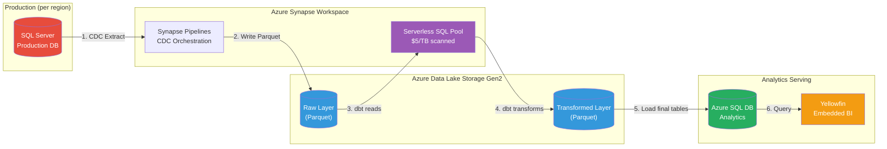
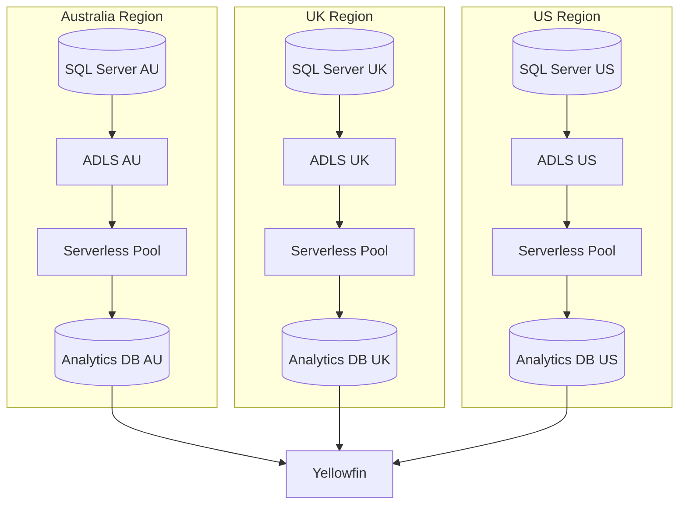

# Architecture Ideas

## Option: Lakehouse Pattern with Synapse Serverless

This approach decouples analytics workloads from production SQL Server using a CDC-based lakehouse pattern.

### Main Architecture Flow

**Flow:**
1. **CDC Extract** - Synapse Pipeline reads change data from prod SQL Server
2. **Write Parquet** - Lands in ADLS Gen2 raw layer (partitioned by date/region)
3. **dbt reads** - dbt models query raw Parquet via Serverless SQL Pool
4. **dbt transforms** - Output written to transformed layer (also Parquet)
5. **Load final tables** - Mart tables pushed to Azure SQL DB for serving
6. **Query** - Yellowfin queries the analytics DB (not prod!)

### Per-Region Deployment (GDPR Compliant)

Each region keeps its own data lake and analytics DB, maintaining data sovereignty. Yellowfin connects to multiple data sources.

### Key Benefits

- **Production isolation**: Analytics queries never hit prod SQL Server
- **Cost-effective**: Synapse Serverless is ~$5/TB scanned (same as Athena), negligible for their data volumes
- **Leverages existing investment**: They already have Synapse workspace for orchestration
- **dbt compatible**: `dbt-synapse` adapter supports serverless pools
- **GDPR friendly**: Each region can have isolated storage and compute
- **Near real-time option**: CDC can run frequently for fresher data

### Azure Component Mapping

| AWS/GCP | Azure Equivalent |
|---------|------------------|
| S3 / GCS | Azure Data Lake Storage Gen2 (ADLS Gen2) |
| Athena / BigQuery | Synapse Serverless SQL Pool |
| Glue / Dataflow | Azure Data Factory / Synapse Pipelines |

### Implementation Notes

- SQL Server has native CDC: `sp_cdc_enable_db`, `sp_cdc_enable_table`
- Synapse Pipelines = ADF under the hood (they're already familiar with this)
- Parquet format reduces storage costs and query scan costs
- Partition by date and/or tenant for optimal query performance
