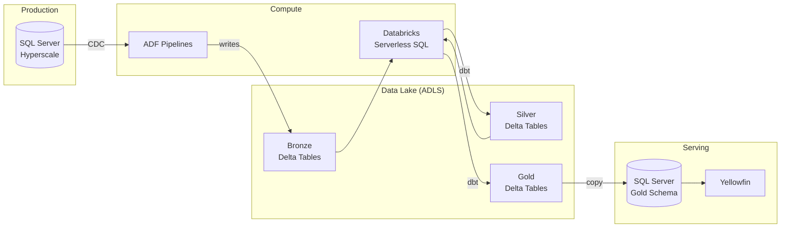
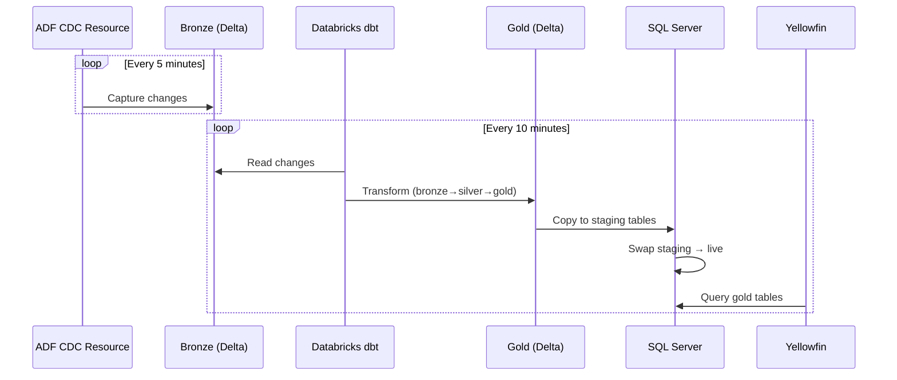
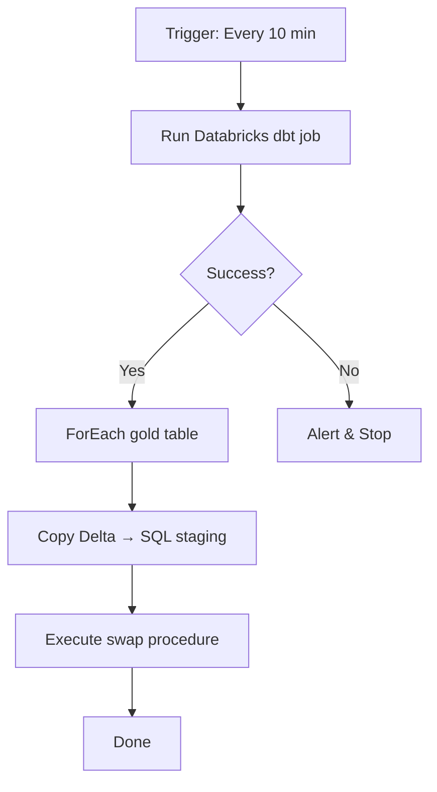

# Option: CDC → Databricks → Push-Back Architecture

## Overview

Decouple analytics from production SQL Server using CDC-based data extraction, serverless transformations, and automated push-back to SQL Server for Yellowfin consumption.

**Key Characteristics:**
- Near real-time data (10-minute refresh)
- Serverless compute (pay for what you use)
- Medallion architecture (bronze → silver → gold)
- Zero analytics load on production database

---

## Architecture

---

## Pipeline Flow

---

## Components

| Component | Technology | Purpose |
|-----------|------------|---------|
| CDC | ADF CDC Resource | Capture changes from SQL Server |
| Storage | ADLS Gen2 + Delta Lake | Medallion layers (bronze/silver/gold) |
| Transform | Databricks Serverless SQL + dbt | SQL transformations |
| Orchestration | ADF Pipelines | Coordinate all steps |
| Serving | SQL Server (gold schema) | Serve to Yellowfin |

---

## Orchestration (ADF Pipeline)

ADF triggers Databricks via linked service. Native integration, no custom code needed.

---

## Sizing by Region

| Region Size | Examples | Databricks Cluster | Refresh Frequency |
|-------------|----------|-------------------|-------------------|
| Large | AU, US, UK | 2x-Small / Small | 10 min |
| Mid | AU Gov, UAE, DE | 2x-Small | 10 min |
| Small | JP, SG, CA, QA, US Gov | 2x-Small | 10-20 min |

Serverless SQL auto-scales. Start small, adjust based on dbt job duration.

---

## Cost Estimate (per region)

| Component | Monthly Cost |
|-----------|-------------|
| ADF CDC Resource | $50-80 |
| ADLS Storage (Delta) | $20-50 |
| Databricks Serverless | $100-250 |
| ADF Orchestration | $20-40 |
| **Total** | **$190-420** |

Fits within stated budget ($250-1000/region).

---

## Blue-Green Swap Pattern

To avoid query disruption during refresh:

1. Copy new data to `gold_staging.TableName`
2. Execute swap procedure (schema transfer or view swap)
3. Queries in-flight continue on old data
4. New queries hit fresh data

For 10-minute refreshes with fast gold-layer queries, brief lock wait is acceptable.

---

## Key Benefits

- **Production isolation**: No analytics queries on operational DB
- **Serverless**: No idle compute costs
- **Incremental**: CDC captures only changes
- **Familiar tooling**: dbt for transforms, ADF for orchestration
- **Yellowfin unchanged**: Still queries SQL Server

## Trade-offs

- **Added latency**: 10-minute delay vs real-time views
- **More components**: CDC + Delta + Databricks + push-back
- **Data duplication**: Gold layer in Delta AND SQL Server

---

## Implementation Phases

1. **POC (1-2 weeks)**: Single table, single region, validate CDC → dbt → push-back
2. **Pilot (2-4 weeks)**: One module (e.g., Risks), production region
3. **Rollout**: Remaining modules, then remaining regions

