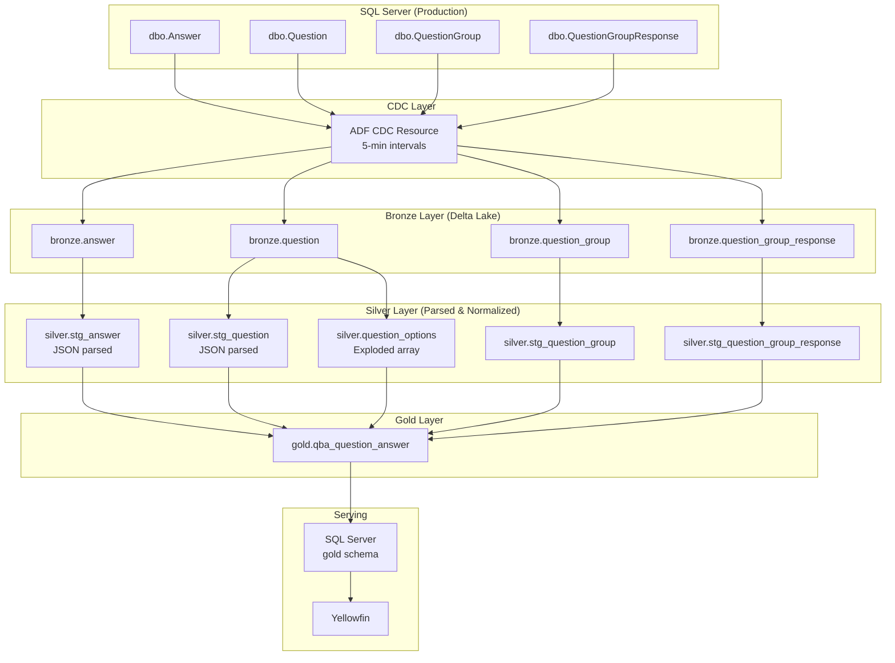
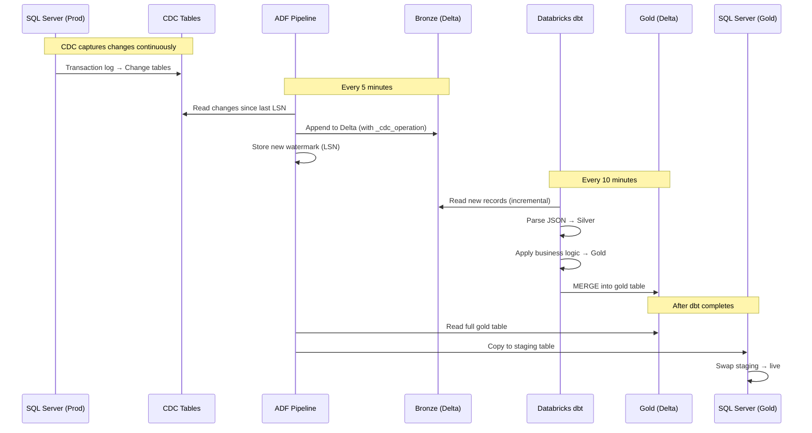
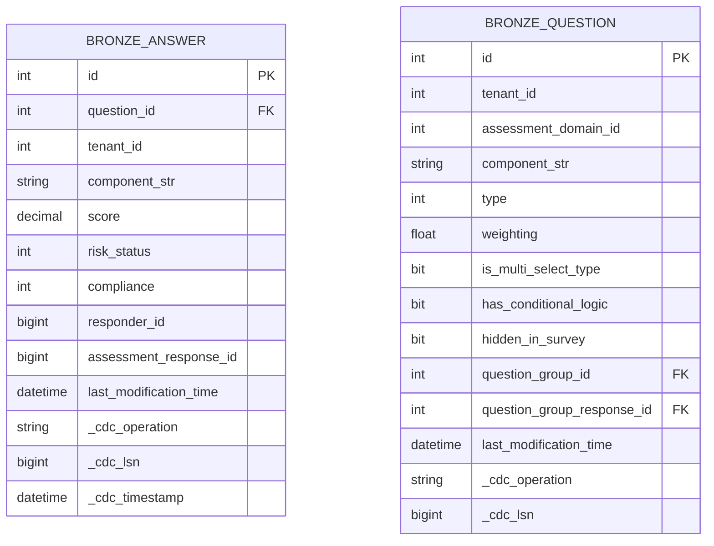
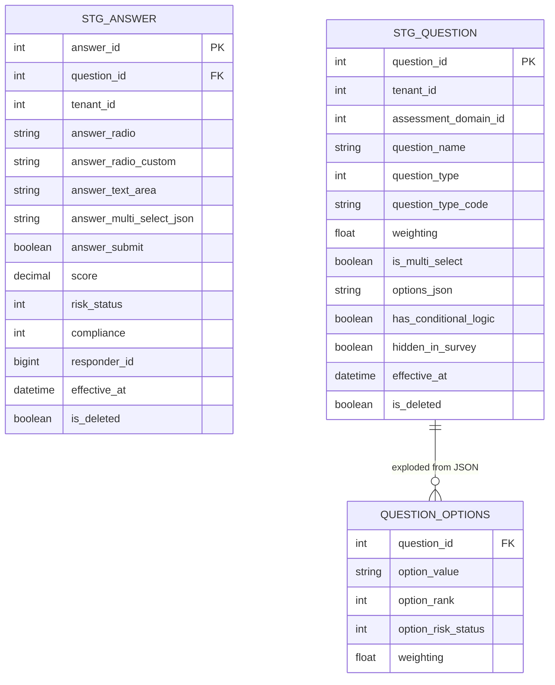
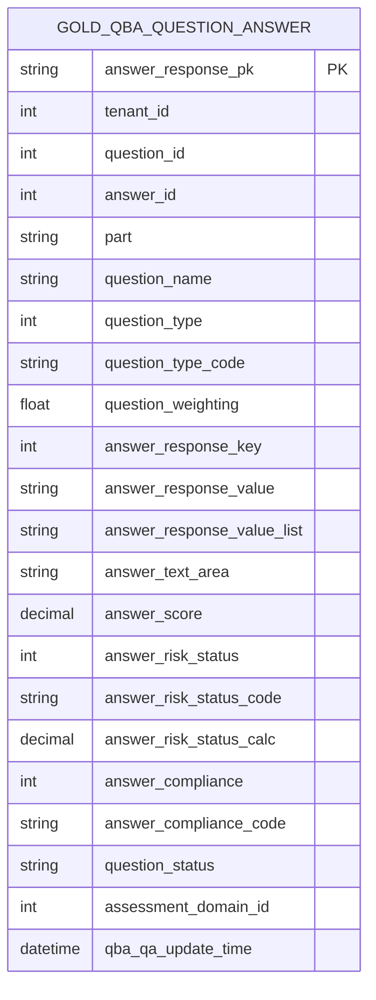
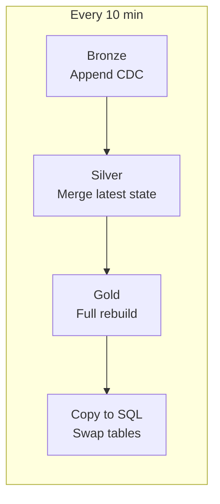
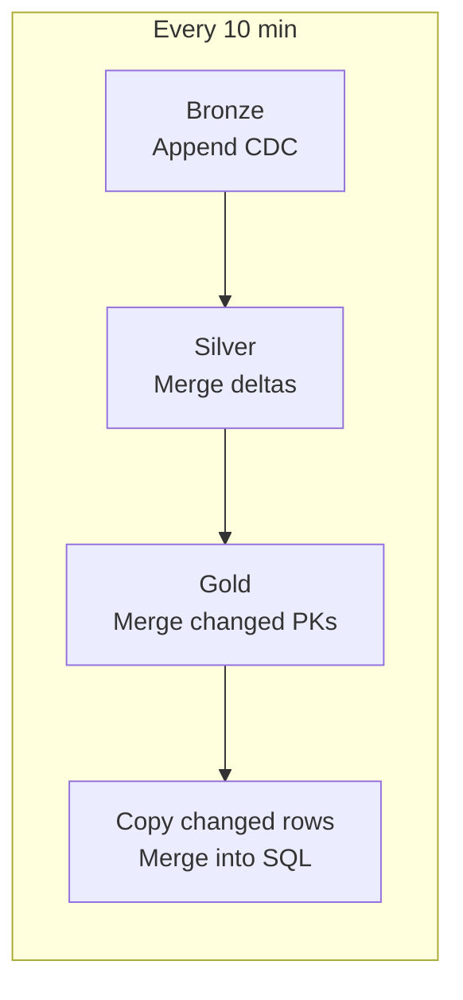
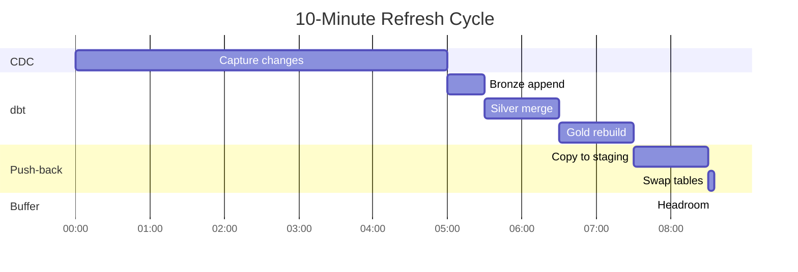

# QBA Question Answer: Medallion Implementation

## Overview

Implementation plan for migrating `vwQBA_QuestionAnswer` (766 lines of SQL with heavy JSON parsing) to the CDC → Databricks → Push-back architecture.

---

## Source Tables (Verified from DDL)

All tables exist in `dbo` schema with standard audit columns (`CreationTime`, `LastModificationTime`, `IsDeleted`).

| Table | Key Columns | CDC Priority |
|-------|-------------|--------------|
| `dbo.Answer` | Id, QuestionId, TenantId, ComponentStr (JSON), Score, RiskStatus | High |
| `dbo.Question` | Id, TenantId, ComponentStr (JSON), Type, Weighting, IsMultiSelectType* | High |
| `dbo.QuestionGroup` | Id, TenantId, Name | Medium |
| `dbo.QuestionGroupResponse` | Id, TenantId, QuestionGroupId, Response, Compliance | Medium |

*`IsMultiSelectType` is a computed column: `CASE WHEN Type IN (3,7,8) THEN 1 ELSE 0 END`

---

## Architecture



---

## Incremental Data Flow



---

## Layer Details

### Bronze Layer: Raw CDC Data

Bronze models are simple - just land the CDC data with metadata.



**Incremental Strategy**: Append-only. Each CDC batch adds new rows.

```sql
-- bronze/answer.sql
{{ config(
    materialized='incremental',
    incremental_strategy='append',
    unique_key=None  -- Append all CDC records
) }}

SELECT 
    *,
    __$operation AS _cdc_operation,
    __$start_lsn AS _cdc_lsn,
    CURRENT_TIMESTAMP() AS _cdc_loaded_at
FROM {{ source('cdc', 'dbo_Answer_CT') }}

WHERE __$start_lsn > (SELECT COALESCE(MAX(_cdc_lsn), 0) FROM {{ this }})

```

---

### Silver Layer: Parsed & Normalized

JSON parsing happens **once** here. This is where the performance gain comes from.



**Incremental Strategy**: Merge on primary key. Apply latest state.

```sql
-- silver/stg_answer.sql
{{ config(
    materialized='incremental',
    incremental_strategy='merge',
    unique_key='answer_id'
) }}

WITH ranked AS (
    SELECT 
        *,
        ROW_NUMBER() OVER (
            PARTITION BY id 
            ORDER BY _cdc_lsn DESC
        ) AS rn
    FROM {{ ref('bronze_answer') }}
    
    WHERE _cdc_loaded_at > (SELECT MAX(_cdc_loaded_at) FROM {{ this }})
    
)

SELECT
    id AS answer_id,
    question_id,
    tenant_id,
    
    -- Parse JSON once, store as columns
    get_json_object(component_str, '$.Radio') AS answer_radio,
    get_json_object(component_str, '$.RadioCustom') AS answer_radio_custom,
    get_json_object(component_str, '$.TextArea') AS answer_text_area,
    get_json_object(component_str, '$.MultiSelectValues') AS answer_multi_select_json,
    CAST(get_json_object(component_str, '$.Submit') AS BOOLEAN) AS answer_submit,
    
    score,
    max_possible_score,
    risk_status,
    compliance,
    responder_id,
    assessment_response_id,
    
    COALESCE(last_modification_time, creation_time) AS effective_at,
    CASE WHEN _cdc_operation = 1 THEN TRUE ELSE is_deleted END AS is_deleted,
    _cdc_loaded_at

FROM ranked
WHERE rn = 1  -- Latest version per answer
```

```sql
-- silver/question_options.sql (Explode JSON array ONCE)
{{ config(materialized='table') }}

SELECT
    q.question_id,
    q.weighting AS question_weighting,
    opt.value AS option_value,
    CAST(opt.rank AS INT) AS option_rank,
    CAST(opt.riskStatus AS INT) AS option_risk_status
    
FROM {{ ref('stg_question') }} q
LATERAL VIEW OUTER explode(
    from_json(options_json, 'array<struct<value:string,rank:int,riskStatus:int>>')
) AS opt
WHERE q.is_multi_select = TRUE
  AND q.is_deleted = FALSE
```

---

### Gold Layer: Business Logic

The final table combines all pieces. **No JSON parsing** - just joins and CASE statements.



**Incremental Strategy**: Full rebuild OR merge based on modified timestamps.

```sql
-- gold/qba_question_answer.sql
{{ config(
    materialized='incremental',
    incremental_strategy='merge',
    unique_key='answer_response_pk',
    partition_by={'field': 'tenant_id', 'data_type': 'int'}
) }}

-- Detect which questions/answers changed




WITH questions AS (
    SELECT * FROM {{ ref('stg_question') }}
    WHERE is_deleted = FALSE
    
    AND effective_at > ({{ last_run }})
    
),

answers AS (
    SELECT * FROM {{ ref('stg_answer') }}
    WHERE is_deleted = FALSE
    
    AND effective_at > ({{ last_run }})
    
),

question_options AS (
    SELECT * FROM {{ ref('question_options') }}
),

-- ... (rest of the business logic from original view)
-- Single answer, multi-select, freetext, no-answer, group variants
-- All UNIONed together

final AS (
    SELECT * FROM qa_single
    UNION ALL SELECT * FROM qa_multi
    UNION ALL SELECT * FROM qa_freetext
    UNION ALL SELECT * FROM qa_no_answer
    UNION ALL SELECT * FROM qa_group_single
    UNION ALL SELECT * FROM qa_group_multi
)

SELECT 
    *,
    CONCAT(answer_id, '_', answer_response_key) AS answer_response_pk
FROM final
```

---

## Incremental Refresh Patterns

### Option A: Full Table Refresh (Recommended for Start)



**Why**: Their data volumes (10s of thousands per tenant) make full rebuild fast (~10-30 seconds on Databricks).

**Gold model config**:
```sql
{{ config(materialized='table') }}
```

---

### Option B: True Incremental (If Needed Later)



**When to use**: If gold table grows to millions of rows and full refresh becomes slow.

**Gold model config**:
```sql
{{ config(
    materialized='incremental',
    incremental_strategy='merge',
    unique_key='answer_response_pk',
    on_schema_change='append_new_columns'
) }}
```

**Challenge**: Detecting all affected rows when a Question changes (affects all its Answers).

---

## Handling Edge Cases

### Deletes

CDC captures deletes with `__$operation = 1`. Handle in Silver:

```sql
CASE WHEN _cdc_operation = 1 THEN TRUE ELSE is_deleted END AS is_deleted
```

Gold layer filters: `WHERE is_deleted = FALSE`

### Late-Arriving Data

Bronze is append-only, so late data just appends. Silver merge picks up latest LSN per PK.

### Schema Evolution

Bronze stores raw JSON. If source schema changes:
1. New columns in Bronze (append)
2. Update Silver parsing logic
3. dbt handles downstream propagation

---

## dbt Project Structure

```
models/
├── sources.yml                      # CDC source definitions
├── bronze/
│   ├── bronze_answer.sql
│   ├── bronze_question.sql
│   ├── bronze_question_group.sql
│   └── bronze_question_group_response.sql
├── silver/
│   ├── stg_answer.sql              # JSON parsed
│   ├── stg_question.sql            # JSON parsed  
│   ├── question_options.sql        # Exploded options array
│   ├── stg_question_group.sql
│   └── stg_question_group_response.sql
└── gold/
    └── qba_question_answer.sql     # Final denormalized table
```

---

## Performance Comparison

| Aspect | Current (View) | New (Medallion) |
|--------|---------------|-----------------|
| JSON parsing | Every Yellowfin query | Once (Silver layer) |
| `openjson()` explosion | Every query | Once (Silver layer) |
| 6-way UNION | Every query | Pre-materialized |
| Window functions | Every query | Pre-computed |
| Execution location | Production SQL Server | Databricks Serverless |
| Yellowfin query | 766 lines of SQL | Simple `SELECT *` |
| Query time | Minutes | Seconds |

---

## Push-Back to SQL Server

### Table Swap (Blue-Green)

```sql
-- ADF executes this stored procedure after copy
CREATE PROCEDURE gold.SwapQBAQuestionAnswer
AS
BEGIN
    BEGIN TRANSACTION;
    
    -- Swap staging to live
    IF OBJECT_ID('gold.qba_question_answer_old') IS NOT NULL
        DROP TABLE gold.qba_question_answer_old;
    
    IF OBJECT_ID('gold.qba_question_answer') IS NOT NULL
        EXEC sp_rename 'gold.qba_question_answer', 'qba_question_answer_old';
    
    EXEC sp_rename 'gold_staging.qba_question_answer', 'gold.qba_question_answer';
    
    COMMIT;
END
```

### Yellowfin View (Optional - for zero-downtime)

```sql
-- Yellowfin queries this view
CREATE VIEW reporting.vwQBA_QuestionAnswer AS
SELECT * FROM gold.qba_question_answer;
```

---

## Orchestration Timeline



Total cycle: ~8.5 minutes with 1.5 min buffer before next cycle.

---

## Migration Steps

1. **Enable CDC** on 4 source tables in SQL Server
2. **Create ADF CDC Resource** pointing to Delta Lake
3. **Deploy dbt models** (bronze → silver → gold)
4. **Create ADF pipeline** for push-back + swap
5. **Test** with one tenant's data
6. **Validate** output matches existing view
7. **Switch** Yellowfin to new gold table
8. **Deprecate** old view

