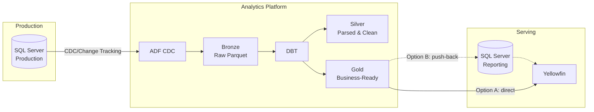
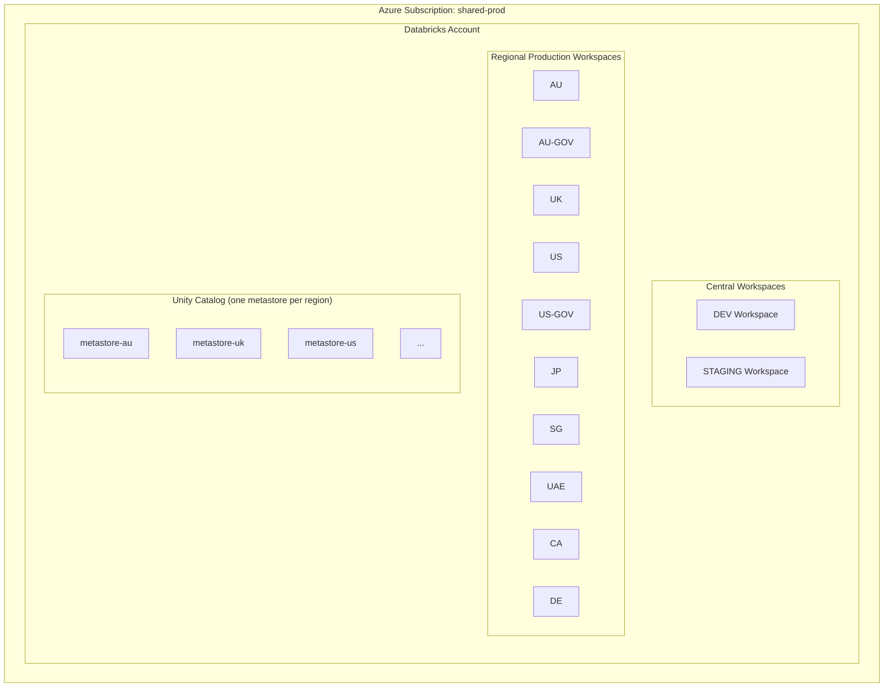
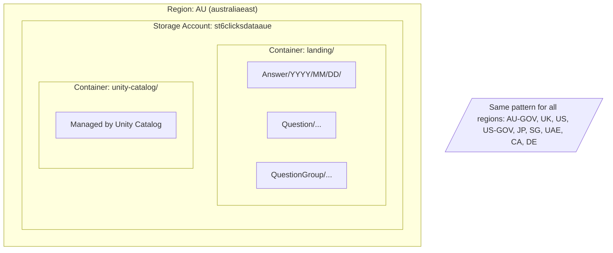
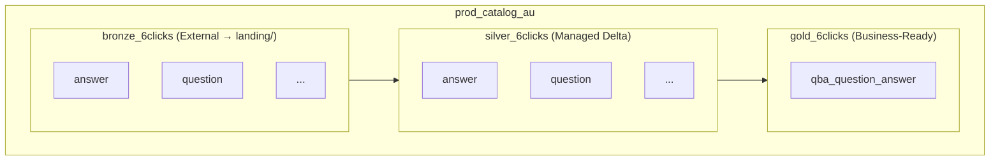

# Databricks PoC Architecture

## 1. Overview

**Goal:** Validate Databricks as the analytics platform for 6clicks, replacing direct SQL Server queries with a proper data warehouse architecture.

**PoC Scope:** Single region (AU), single model (`vwQBA_QuestionAnswer`), 4 weeks.

**Success Criteria:**
- End-to-end data flow working (SQL Server → Databricks → Yellowfin)
- Performance comparable or better than current Synapse approach
- Clear cost picture for multi-region rollout
- Infrastructure as Code ready for replication

---

## 2. Target Architecture

**Data Flow:**
1. Enable CDC or Change Tracking on required source tables in SQL Server
2. ADF scheduled pipeline extracts changes → writes to Bronze (Parquet)
3. Databricks External Tables point to Bronze layer
4. dbt runs on Databricks Serverless SQL: Bronze → Silver → Gold
5. Yellowfin queries Gold tables via:
   - **Option A (Primary):** Direct connection to Databricks Serverless SQL
   - **Option B (Fallback):** Push Gold tables back to SQL Server reporting schema (if Yellowfin connectivity is problematic)

---

## 3. Databricks Account Structure

**Key Decisions:**
- **Single Databricks Account** in shared-prod subscription (simplifies billing & governance)
- **Central DEV & STAGING workspaces** for development and pre-prod testing
- **One PROD workspace per region** for data residency compliance
- **One Unity Catalog metastore per region** (data stays in region)

---

## 4. Storage Layout (ADLS)

Each region gets its own storage account to ensure data residency.

**Catalog & Schema Structure (per region):**

---

## 5. Key Requirements

| Requirement | Approach |
|-------------|----------|
| **Data Residency** | One storage account + Unity Catalog metastore per region. Data never leaves the region. |
| **AU-GOV Separation** | Dedicated workspace with separate access controls |
| **Dedicated Instances** | Can share infrastructure; data isolation via separate catalogs/schemas |
| **Data Retention** | Delta Lake supports deletion; can purge tenant data when needed |
| **Dev/Prod Separation** | Separate workspaces (DEV, STAGING, PROD per region) |
| **Cost Efficiency** | Serverless SQL (pay per query); no idle compute |

**Budget Targets:**
- Large regions (AU, US, UK): $1000/month
- Mid-size regions (AU-GOV, UAE, DE): $500/month
- Small regions (JP, SG, CA, US-GOV): $250/month

---

## 6. PoC Scope (4 Weeks)

**Region:** AU only  
**Model:** `vwQBA_QuestionAnswer` (already implemented on Synapse — enables direct comparison)

**Week 1-2: Infrastructure (Platform Team)**
- Databricks account & AU workspace
- ADLS storage account with landing + unity-catalog containers
- Unity Catalog metastore for AU
- Bicep templates for all resources

**Week 2-4: Data Pipeline (Data Team)**
- Enable CDC/Change Tracking on source tables
- ADF pipeline (using bicep): SQL Server → landing/ (Parquet)
- Bronze external tables
- dbt models: Silver + Gold
- Yellowfin connection to Databricks Serverless SQL

---

## 7. Task Breakdown

### Platform Team (Infra)

| Task | Description | Deliverable |
|------|-------------|-------------|
| **P1** | Create Databricks account in shared-prod | Account ID |
| **P2** | Create AU workspace | Workspace URL |
| **P3** | Create ADLS storage account (HNS enabled) | Storage account + containers |
| **P4** | Create Unity Catalog metastore for AU | Metastore assigned to workspace |
| **P5** | Create Access Connector for Unity Catalog | Managed identity with storage access |
| **P6** | Azure AD groups for RBAC | Groups synced to Databricks |
| **P7** | Bicep templates for all above | IaC in repo, ready for other regions |

### Data Team

| Task | Description | Deliverable |
|------|-------------|-------------|
| **D1** | Identify source tables for QBA model | List of ~5-10 tables |
| **D2** | Enable CDC/Change Tracking on source tables | CDC enabled in SQL Server |
| **D3** | Create ADF pipeline (SQL Server → landing/) | Pipeline running on schedule |
| **D4** | Create Bronze external tables | Tables in bronze_6clicks schema |
| **D5** | Create dbt project structure | Project with Silver + Gold models |
| **D6** | Implement QBA Silver models | Parsed, cleaned tables |
| **D7** | Implement QBA Gold model | `qba_question_answer` table |
| **D8** | Connect Yellowfin to Databricks | Working reports |
| **D9** | *(Fallback)* ADF pipeline to push Gold → SQL Server | Reporting schema populated |

---

## 8. Next Steps

1. **Platform Team:** Start P1-P3 this week
2. **Data Team:** Start D1-D2 (source table identification, CDC enablement)
3. **Review:** Mid-PoC checkpoint at Week 2
4. **Handoff:** Bicep templates + working pipeline by Week 4

