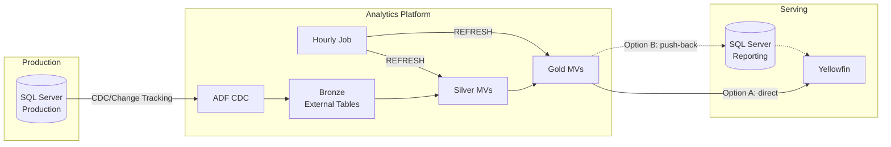
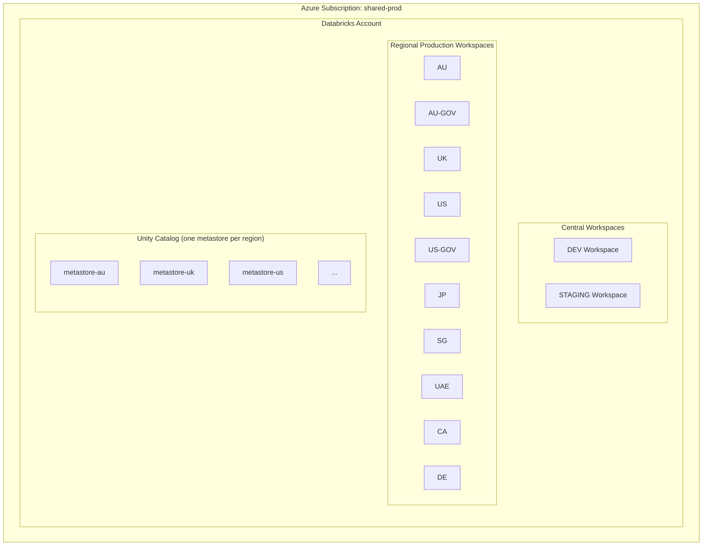
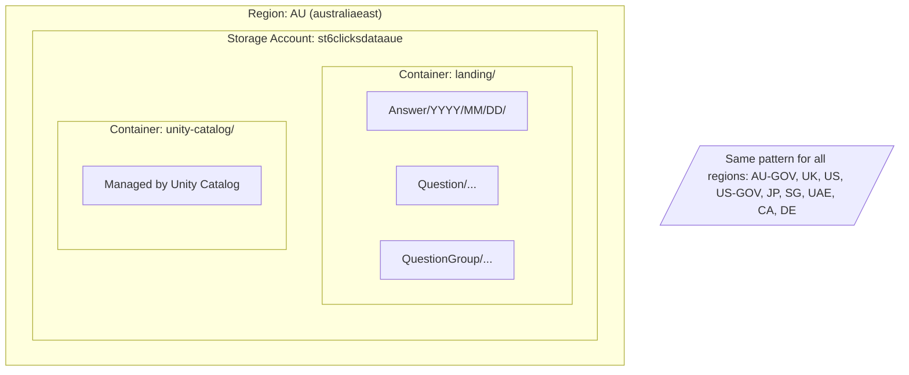
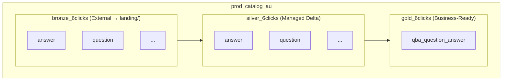

# Databricks PoC Architecture

## 1. Overview

**Goal:** Validate Databricks as the analytics platform for 6clicks, replacing direct SQL Server queries with a proper data warehouse architecture.

**PoC Scope:** Single region (AU), single model (`vwQBA_QuestionAnswer`), 4 weeks.

**Success Criteria:**

- End-to-end data flow working (SQL Server → Databricks → Yellowfin)  
- Performance comparable or better than current Synapse approach  
- Clear cost picture for multi-region rollout  
- Infrastructure as Code ready for replication
---

## 2. Target Architecture



**Data Flow:**
1. Enable CDC or Change Tracking on required source tables in SQL Server  
2. ADF scheduled pipeline extracts changes → writes to Bronze (Parquet)  
3. Databricks External Tables point to Bronze layer  
4. Databricks Job (hourly) refreshes Materialized Views: Bronze → Silver → Gold  
5. Yellowfin queries Gold tables via:  
   - **Option A (Primary):** Direct connection to Databricks Serverless SQL  
   - **Option B (Fallback):** Push Gold tables back to SQL Server reporting schema (if Yellowfin connectivity is problematic)

---

## 3. Databricks Account Structure



**Key Decisions:**
- **Single Databricks Account** in shared-prod subscription (simplifies billing & governance)
- **Central DEV & STAGING workspaces** for development and pre-prod testing
- **One PROD workspace per region** for data residency compliance
- **One Unity Catalog metastore per region** (data stays in region)

---

## 4. Storage Layout (ADLS)

Each region gets its own storage account to ensure data residency.



**Catalog & Schema Structure (per region):**



---

## 5. Development Lifecycle

### Materialization Strategy

**All transformations as Materialized Views (MVs):**
- Bronze: External tables pointing to landing Parquet (no refresh needed)
- Silver: MVs with liquid clustering on `TenantId`
- Gold: MVs with liquid clustering on `TenantId`

### Refresh Orchestration

**Approach:** Databricks SQL Warehouse Job runs hourly, refreshes MVs in dependency order.

```
CDC arrives → ADF writes to landing/ → Hourly Job → REFRESH MVs (Silver → Gold)
```

**Job definition (Databricks Workflow):**
```sql
-- Task 1: Refresh Silver MVs (parallel)
REFRESH MATERIALIZED VIEW silver_6clicks.answer;
REFRESH MATERIALIZED VIEW silver_6clicks.question;
REFRESH MATERIALIZED VIEW silver_6clicks.question_options;
REFRESH MATERIALIZED VIEW silver_6clicks.question_group;
REFRESH MATERIALIZED VIEW silver_6clicks.question_group_response;

-- Task 2: Refresh Gold MV (depends on Task 1)
REFRESH MATERIALIZED VIEW gold_6clicks.qba_question_answer;
```

- Schedule: Hourly (or triggered by ADF completion)
- Compute: Serverless SQL Warehouse
- No dbt required for POC

### Testing

- DEV workspace with test data in `test_landing/`
- Manual SQL execution to validate transforms
- Compare Gold output against existing Synapse view

---

## 6. Key Requirements

| Requirement | Approach |
|-------------|----------|
| **Data Residency** | One storage account + Unity Catalog metastore per region. Data never leaves the region. |
| **AU-GOV Separation** | Dedicated workspace with separate access controls |
| **Dedicated Instances** | Can share infrastructure; data isolation via separate catalogs/schemas |
| **Data Retention** | Delta Lake supports deletion; can purge tenant data when needed |
| **Dev/Prod Separation** | Separate workspaces (DEV, STAGING, PROD per region) |
| **Cost Efficiency** | Serverless SQL (pay per query); no idle compute |

**Budget Targets:**
- Large regions (AU, US, UK): $1000/month
- Mid-size regions (AU-GOV, UAE, DE): $500/month
- Small regions (JP, SG, CA, US-GOV): $250/month

---

## 7. PoC Scope (4 Weeks)

**Region:** AU only  
**Model:** `vwQBA_QuestionAnswer` (already implemented on Synapse — enables direct comparison)

**Week 1-2: Infrastructure (Platform Team)**

- ADLS storage account with landing \+ unity-catalog containers  
- Enable CDC/Change Tracking on source tables  
  - 45 source tables  
  - 942 columns  
  - 18GB of data  
- Getting familiar with Databricks  
- Databricks account & AU workspace  
  - Unity Catalog metastore for AU  
  - Enable SSO  
- Bicep templates for all resources  

**Week 1-4: Data Pipeline (Data Team)**

- Using CDC: ADF pipeline (using bicep): SQL Server → landing/ (Parquet)  
  - Ideally bicep  
  - Select all existing columns in the DDL  
    - This will future-proof us, when the product team makes a change to the database schema they need to notify the data team as well and update the pipeline  
    - Acts as a data contract  
- Bronze external tables  
- Silver + Gold Materialized Views  
- Databricks Job for hourly MV refresh  
- Yellowfin connection to Databricks Serverless SQL