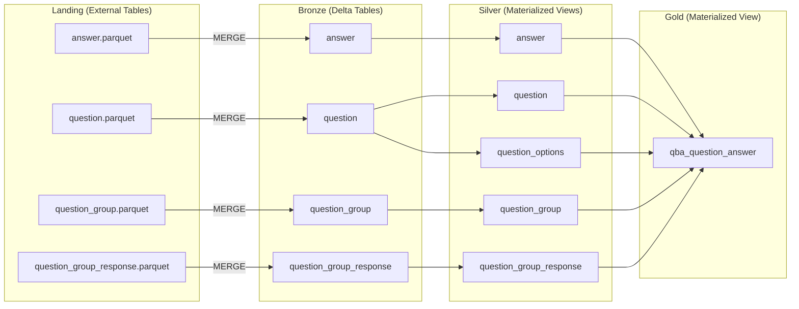

# vwQBA_QuestionAnswer — Query Analysis Notes

## Answer Table Flow

### `a_raw` (lines 10-63)
**Source:** `Answer` table  
**Filter:** `IsDeleted = 0 AND Status = 3`
**Granularity:** 1 row per `Answer` (after filter)

**Transformations:**
- `Answer_LastModificationTime` = `COALESCE(LastModificationTime, CreationTime)` ->  smalldatetime
- `ComponentStr`: empty string `''` ->  `NULL`
- `RiskStatusCode`: 0: No Risk, 6: Very Low, 1: Low, 3: Medium, 4: High, 5: Very High
- `RiskStatusCalc`: same mapping but numeric (0.0 to 5.0)
- `ComplianceCode`: 0: None, 1: Compliant, 2: Not compliant, 3: Partially compliant

### `a` (lines 64-86)
**Source:** `a_raw`

**Transformations:**
- Renames columns with `Answer_` prefix
- `ComponentStr` NULL ->  default JSON: `{"RadioCustom":null,"Radio":null,"TextArea":null,"Submit":false,"MultiSelectValues":null,"Id":0}`
- Extracts `Answer_Submit` from JSON (`$.Submit`)
**Granularity:** 1 row per `Answer`

**Used by:** `qa_multi_json`, `qa_no_answer`, `qa_freetext`, `qa_single`, `qa_group_single`  
**Join key:** `QuestionId`  
**Note:** `qa_group_multi` doesn't join `a` directly — uses `qa_multi_json` which already has `a` baked in  
**Databricks impl:** Clustering on TenantId ->  include TenantId in join/filter for partition pruning

---

## Question Table Flow

### `q_raw` (lines 87-134)
**Source:** `Question` table  
**Filter:** `IsDeleted = 0`
**Granularity:** 1 row per `Question` (after filter)

**Transformations:**
- `Question_LastModificationTime` = `COALESCE(LastModificationTime, CreationTime)` ->  smalldatetime
- `Question_Name` cast to `nvarchar(4000)`
- `Question_TypeCode`: 1: Yes No, 2: Custom, 3: Multiple Choice, 4: Text Response, 5: Geography, 6: Industry, 7: MC Geography, 8: MC Industry, 9: Short Text, 10: Custom Radio
- `Question_IsMultiSelectType`: 1 if Type in (3,7,8), else 0
- `Question_OptionJson`: extracts options array from JSON + appends `{"value":"NULL"}` as sentinel
  - Types 2,5,6,10 :  `$.components.radiocustom.values`
  - Types 3,7,8 :  `$.components.multiselect.values`
  - `json_modify(array, 'append $', {...})` adds fallback option for LEFT JOIN matching

### `q` (lines 135-157)
**Source:** `q_raw`  
**Transformations:** Pass-through, just selects same columns (no additional logic)
**Granularity:** 1 row per `Question`

**Used by:** `qq`, `qa_multi_json`, `qa_no_answer`, `qa_freetext`, `qa_single`, `qa_group_single`

### `qq` (lines 158-168)
**Source:** `q`  
**Filter:** `Question_Type in (3, 7, 8)` — multi-select only
**Granularity:** 1 row per `Question` option (one row per option value)

**Purpose:** Explodes options JSON into rows — one row per option for score lookup

```
q (1 row per question):
| Question_Id | Question_OptionJson                                                           |
|-------------|-------------------------------------------------------------------------------|
| 123         | [{"value":"A","rank":1,"riskStatus":0}, {"value":"B","rank":2,"riskStatus":3}]|

qq (1 row per option):
| Question_Id | Question_Weighting | QuestionOption_Value | QuestionOption_Rank | QuestionOption_RiskStatus |
|-------------|--------------------|----------------------|---------------------|---------------------------|
| 123         | 1.0                | A                    | 1                   | 0                         |
| 123         | 1.0                | B                    | 2                   | 3                         |
```

**Used by:** `qa_multi`, `qa_group_multi` — joined on `Question_Id AND answer_value = QuestionOption_Value`  
**Score calc:** `Question_Weighting × QuestionOption_Rank`

**Note on radiocustom (2,5,6,10):** `Question_OptionJson` IS populated for these types in `q_raw`, but `qq` filters them out.

**Inference:** Given that `qa_single` uses `Answer.Score` directly while `qa_multi` calculates score from `qq`, it looks like single-select scores are pre-calculated (by the app?) and stored in `Answer.Score`/`Answer.RiskStatus` — no lookup needed. Multi-select needs lookup because answer is an array of values. (Needs verification.)

---

## Question + Answer Join (Multi-Select Prep)

### `qa_multi_json` (lines 169-213)
**Source:** `q` JOIN `a` on `Question_Id = Answer_QuestionId`  
**Filter:** `Question_IsMultiSelectType = 1 AND Answer_ComponentStr IS NOT NULL`
**Granularity:** 1 row per multi-select `Answer`

**Purpose:** Prep layer for multi-select — joins Q+A and wraps the answer array for OPENJSON

**Key transformation:**
```sql
'{ "answer" : ' + json_query(a.Answer_ComponentStr, '$.MultiSelectValues') + ' }' Answer_ResponseJson
```
Turns `["A", "C", "D"]` into `{ "answer": ["A", "C", "D"] }` — needed because OPENJSON requires a path to iterate.

**Also extracts:** `Answer_TextArea` from JSON  
**Used by:** `qa_multi`, `qa_group_multi`

---

## Branches

### `qa_no_answer` (lines 215-257)
**Source:** `q` LEFT JOIN `a` on `Question_Id = Answer_QuestionId`  
**Filter:** `Answer_Id IS NULL`
**Granularity:** 1 row per `Question` with no answer

**Purpose:** Catches questions with no answer — creates dummy answer columns with defaults

**Default values:**
- `Answer_Id = 0`
- `Answer_Score = 0`
- `Answer_Compliance = 0`, `Answer_ComplianceCode = 'None'`
- `Answer_RiskStatus = NULL`, `Answer_RiskStatusCode = 'Undefined'`
- `AnswerResponse_Value = 'Not Responded'`
- `Answer_TextArea = 'Not Responded'`
- `AnswerResponse_PK = '0_0'`

**Why:** Ensures every question appears in final output, even if unanswered.  
**Note:** No question type filter — applies to ALL types with no answer.

### `qa_freetext` (lines 258-306)
**Source:** `q` JOIN `a` on `Question_Id = Answer_QuestionId`  
**Filter:** `Question_Type in (4, 9)` — Text Response, Short Text Response
**Granularity:** 1 row per freetext `Answer`

**Key points:**
- `Answer_Score = NULL` — freetext not scored
- `AnswerResponse_Value` = `$.TextArea` from JSON, or `'Blank'` if empty
- `Answer_TextArea = NULL` — content goes to AnswerResponse_Value instead
- `AnswerResponse_PK` = `{Answer_Id}_0`

**Difference:** No scoring, no risk — just captures text response.

### `qa_single` (lines 307-356)
**Source:** `q` JOIN `a` on `Question_Id = Answer_QuestionId`  
**Filter:** `Question_IsMultiSelectType = 0 AND Answer_ComponentStr IS NOT NULL AND Question_Type in (1, 2, 5, 6, 10)`
**Granularity:** 1 row per single-select `Answer`

**Key points:**
- `AnswerResponse_Value` extracted by type:
  - Type 1 (Yes/No): `$.Radio`
  - Types 2, 5, 6, 10: `$.RadioCustom`
- `Answer_Score`, `Answer_RiskStatus` — direct from `a` (pre-calculated by app)
- `Answer_TextArea` = `$.TextArea` (explanatory notes)
- `AnswerResponse_PK` = `{Answer_Id}_0`

**Difference from multi-select:** Score/risk already calculated, just extracts selected value.

### `qa_multi` (lines 357-431)
**Source:** `qa_multi_json` OUTER APPLY OPENJSON + LEFT JOIN `qq`  
**Join:** `qq.Question_Id = qa.Question_Id AND answer_kv.value = qq.QuestionOption_Value`
**Granularity:** 1 row per selected option (`Answer_Id` + option value)

**This is where the explosion happens** — one row per selected option.

**Key transformations:**
- `OPENJSON(Answer_ResponseJson, '$.answer')` — explodes selected values array
- `Answer_Score` = `Question_Weighting × QuestionOption_Rank` (calculated, not from app)
- `Answer_RiskStatus` = `qq.QuestionOption_RiskStatus` (from option lookup)
- `RiskStatusCode/Calc` — derived from option's riskStatus
- `Question_MaxPossibleScore` = `SUM(Weighting × Rank) OVER (PARTITION BY Question_Id)` — sum of ALL options
- `AnswerResponse_key` = array index + 1
- `AnswerResponse_Value` = the selected value
- `AnswerResponse_PK` = `{Answer_Id}_{key}` — unique per selected option

**Key difference from single:** Score/risk calculated here by joining to `qq`, not pre-calculated.

---

## Question Groups

### `QuestionGroup` (lines 432-437)
**Source:** `QuestionGroup` table  
**Filter:** `IsDeleted = 0`
**Granularity:** 1 row per `QuestionGroup`

Just pulls `Id`. Used only for join validation — ensures group exists and isn't deleted.

### `QuestionGroupResponse` (lines 438-447)
**Source:** `QuestionGroupResponse` table  
**Filter:** `IsDeleted = 0`
**Granularity:** 1 row per `QuestionGroupResponse`

**Columns:** `Id`, `IdRef`, `Response`, `Compliance`, `AssessmentResponseId`

**What it is:** Group-level response metadata.

**Inferred roles** (based on how they're joined/used):

| Entity | Inferred Role |
|--------|---------------|
| `q` (Question) | Individual question definition |
| `a` (Answer) | Individual answer to individual question |
| `QuestionGroup` | Grouping container (only used for join validation) |
| `QuestionGroupResponse` | Appears to provide shared response data that overrides some answer fields |

---

## Group Branches

### `qa_group_single` (lines 448-491)
**Source:** `q` JOIN `QuestionGroup` JOIN `QuestionGroupResponse` JOIN `a`  
**Filter:** `Question_IsMultiSelectType = 0 AND Answer_ComponentStr IS NOT NULL AND Question_Type in (1, 2, 5, 6, 10)`
**Granularity:** 1 row per grouped single-select `Answer`

**Purpose:** Handles single-select questions that belong to a **Question Group**.

**Inference:** Given that `QuestionGroupResponse` has its own `Compliance` and `Response` fields, and this CTE overrides `Answer_Compliance` with the group's compliance, it looks like groups are sets of related questions that share a common compliance assessment — the group has ONE compliance status and ONE text response that applies to all questions in it. (Needs verification with 6clicks team.)

**QuestionGroupResponse OVERRIDES these fields:**
- `Answer_Compliance` ← `QuestionGroupResponse.Compliance` (group-level compliance)
- `Question_IdRef` ← `QuestionGroupResponse.IdRef` (group's reference ID)
- `AnswerResponse_Value` ← `QuestionGroupResponse.Response` (group's text response)
- `Answer_AssessmentResponseId` ← `QuestionGroupResponse.AssessmentResponseId`

**Still from `a`:** Score, RiskStatus — individual question scoring still happens, just compliance is shared.

### `qa_group_multi` (lines 492-568)
**Source:** `qa_multi_json` OUTER APPLY OPENJSON + LEFT JOIN `qq` + JOIN `QuestionGroup` + JOIN `QuestionGroupResponse`
**Granularity:** 1 row per selected option (`Answer_Id` + option value), grouped

**Same as `qa_multi`** but for grouped questions. Score calculated from `qq`, with group-level joins for validation.

**Note:** Unlike `qa_group_single`, this does NOT override compliance/response from QuestionGroupResponse — it still uses the exploded multi-select values.

---

## Combine & Finalize

### `qa` (lines 569-587)
**Source:** UNION of all 6 branches
**Granularity:** Mixed (answer-level, option-level, and question-no-answer)

```sql
select 'single' part, * from qa_single
union 
select 'multi' part, * from qa_multi
union 
select 'freetext' part, * from qa_freetext
union 
select 'group single' part, * from qa_group_single
union 
select 'group multi' part, * from qa_group_multi
union 
select 'no answer' part, * from qa_no_answer
```

**Note:** Uses `UNION` (not `UNION ALL`) — would dedupe identical rows, but rows differ by `part` and other columns so no deduping happens in practice.

### `final` (lines 589-701)
**Source:** `qa`
**Granularity:** Mixed (same as `qa`)

**Purpose:** Apply display logic — transform raw values into report-friendly values with special handling for edge cases.

**Key transformations:**

| Column | Logic |
|--------|-------|
| `AnswerResponse_Value` | 'Blank' if skip logic, NULL, or empty; 'Not Responded' handled in qa_no_answer |
| `Answer_TextArea` | 'Blank because skip logic is applied' or 'Blank because Question is not responded to' |
| `Question_Status` | 'Skip Logic Applied' / 'Responded' / 'Not Answered' based on `HiddenInSurveyForConditional` and `ResponderId` |
| `Answer_Score` | NULL if skip logic or freetext; 0 if no answer; else from upstream |
| `Answer_RiskStatus` | NULL if skip logic or freetext; 0 if no answer; else from upstream |
| `Answer_RiskStatusCode` | 'Skip Logic Applied' / 'Not Risk Rated' / 'Not Answered' or actual label |
| `Answer_RiskStatusCalc` | NULL if skip logic or freetext; 0.00 if no answer; else from upstream |
| `QBA_QA_UpdateTime` | `MAX(Answer_LastModificationTime, Question_LastModificationTime)` — latest of the two |

**Key insight:** This is where NULL handling and display labels are applied. Upstream CTEs have raw values; `final` makes them report-ready.

### `answer_list` (lines 702-713)
**Source:** `final`
**Granularity:** Question-level (per `Answer_TenantId` + `Question_AssessmentDomainId` + `Question_Id`)

**Purpose:** Aggregate all response values into a comma-separated list per question.

```sql
STRING_AGG(f.AnswerResponse_Value, ', ') as AnswerResponseValue_List
GROUP BY Answer_TenantId, Question_AssessmentDomainId, Question_Id
```

**Use case:** For multi-select questions with multiple rows, this creates a single "A, B, C" summary string.

### `main` (lines 714-757)
**Source:** `final` JOIN `answer_list`
**Granularity:** Detail rows (same as `final`, with aggregated list attached)

**Purpose:** Attach the aggregated response list to each detail row.

```sql
SELECT DISTINCT ... 
FROM final f
JOIN answer_list al ON al.Answer_TenantId = f.Answer_TenantId
    AND al.Question_AssessmentDomainId = f.Question_AssessmentDomainId
    AND al.Question_Id = f.Question_Id
```

**Note:** `SELECT DISTINCT` here — removes any duplicate rows (though as discussed, branches have different `part`/`AnswerResponse_PK` so duplicates unlikely).

### Final SELECT (lines 759-761)
**Source:** `main`
**Granularity:** Detail rows (same as `main`)

```sql
SELECT *, RANK() OVER (ORDER BY Question_Id, COALESCE(AnswerResponse_PK, '')) as QBA_QuestionAnswer_pk
FROM main
```

**Purpose:** Add surrogate key `QBA_QuestionAnswer_pk` — deterministic ordering for consistent row identification across refreshes.

---

## Questions to Clarify with 6clicks Team

### 1. Two Different Representations of Grouped Questions

**Observation:** `qa_single` and `qa_multi` do NOT exclude grouped questions. Meanwhile, `qa_group_single` and `qa_group_multi` include only grouped questions. This means a grouped question appears in **two branches with different data**:

| Branch | `part` | `AnswerResponse_Value` | `Answer_Compliance` |
|--------|--------|------------------------|---------------------|
| `qa_single` | 'single' | From `$.RadioCustom`/`$.Radio` | From `Answer.Compliance` |
| `qa_group_single` | 'group single' | From `QuestionGroupResponse.Response` | From `QuestionGroupResponse.Compliance` |

These are **not duplicates** — they're two different representations of the same answer:
1. Individual answer data (from Answer table)
2. Group-level override data (from QuestionGroupResponse)

`SELECT DISTINCT` won't collapse them because the values are actually different.

**Question:** Is this intentional (reports need both perspectives?) or should grouped questions be excluded from the regular branches?

### 2. `qa_group_multi` Joins but Doesn't Use QuestionGroupResponse

**Observation:** `qa_group_multi` joins to `QuestionGroup` and `QuestionGroupResponse` but doesn't SELECT any columns from them (unlike `qa_group_single` which overrides compliance, IdRef, Response, etc.).

The only apparent effect is:
- Filtering (INNER JOIN excludes questions without valid groups)
- `AnswerResponse_PK` includes `QuestionGroupResponseId`

**Question:** Is this intentional, or should `qa_group_multi` also override some fields from `QuestionGroupResponse`?

### 3. What Are Question Groups For?

**Observation:** Based on code, it looks like groups share compliance assessment across related questions. But this is inferred.

**Question:** What's the actual business purpose of Question Groups? When/why are they used?

---

## Suggested Medallion Architecture



### Why This Structure?

| Decision | Reason |
|----------|--------|
| **Landing in Parquet** | Reduce computational overhead on the CDC pipeline in ADF. |
| **Bronze as Delta tables** | MVs only do incremental refresh from Delta sources. External Parquet = full recompute every time. |
| **Landing ->  Bronze MERGE** | Hourly upsert from CDC Parquet into Delta. Enables change tracking. |
| **No filtering in Bronze** | Keep all rows, including soft-deleted items; apply delete filters in Silver/Gold. |
| **POC = latest snapshot only** | Keep current state in Bronze for now; if change history is needed later, build it from Bronze. |
| **Bronze file retention** | Option to delete or archive old Bronze files; recommend delete for now to match Synapse pipeline and no current retention requirement. |
| **Silver as MVs** | Clean single-source transforms (filters, type codes, JSON parsing). Incremental refresh. |
| **`question_options` in Silver** | Explodes JSON once. Avoids repeated LATERAL VIEW in Gold. |
| **Gold as single MV** | All business logic (6-way union, joins, aggregations) in one place. Mirrors existing DDL. |
| **Promote reusable logic to Silver** | Move shared transforms into Silver so multiple Gold outputs can reuse them. |
| **Keep Gold focused on business logic** | Reserve Gold for joins, unions, and reporting logic rather than base cleanup. |
| **Materialize Gold intermediates if Gold gets slow** | Persist heavy steps (e.g., `qa`/`final`) if performance becomes an issue. |
| **Cluster by TenantId** | Multi-tenant workload. Partition pruning on tenant filters. |

### Silver to CTE Mapping

| Silver Table | Original CTE(s) | Granularity | Notes |
|-------------|------------------|-------------|-------|
| `silver_6clicks.answer` | `a_raw`, `a` | 1 row per `Answer` | Filters + base transforms + answer defaults. |
| `silver_6clicks.question` | `q_raw`, `q` | 1 row per `Question` | Question filters + type/JSON extraction. |
| `silver_6clicks.question_options` | `qq` | 1 row per `Question` option | Exploded options for multi-select scoring. |
| `silver_6clicks.question_group` | `QuestionGroup` | 1 row per `QuestionGroup` | Group existence filter only. |
| `silver_6clicks.question_group_response` | `QuestionGroupResponse` | 1 row per `QuestionGroupResponse` | Group response metadata. |

### Gold Logic (from original CTEs)

| Gold Logic | Original CTE(s) | Granularity | Purpose |
|------------|------------------|-------------|---------|
| Multi-select prep | `qa_multi_json` | 1 row per multi-select `Answer` | Join Q+A and wrap multi-select JSON for explode. |
| Answer branches | `qa_no_answer`, `qa_freetext`, `qa_single`, `qa_multi`, `qa_group_single`, `qa_group_multi` | Mixed (answer, answer-option, question-no-answer) | Build per-type answer rows and scoring. |
| Union all answers | `qa` | Mixed | Combine all branches into one stream. |
| Report shaping | `final` | Mixed | Apply skip-logic display rules and derived fields. |
| Aggregation + final output | `answer_list`, `main`, final SELECT | `answer_list`: question-level ; `main`/final: detail rows | Add response list and surrogate key. |

### Refresh Flow

```
ADF CDC ->  Landing (Parquet) ->  MERGE ->  Bronze (Delta) ->  REFRESH ->  Silver (MVs) ->  REFRESH ->  Gold (MV)
```

Hourly Databricks Job, 3 sequential tasks. No dbt — pure SQL.

### POC First Step

Start with Bronze as Delta tables + regular views for Silver/Gold. Since Bronze handles clustering on `TenantId` and dedup via MERGE, views can leverage that for fast queries. If performance is acceptable, no need to add MV. Upgrade to MVs later if needed.
