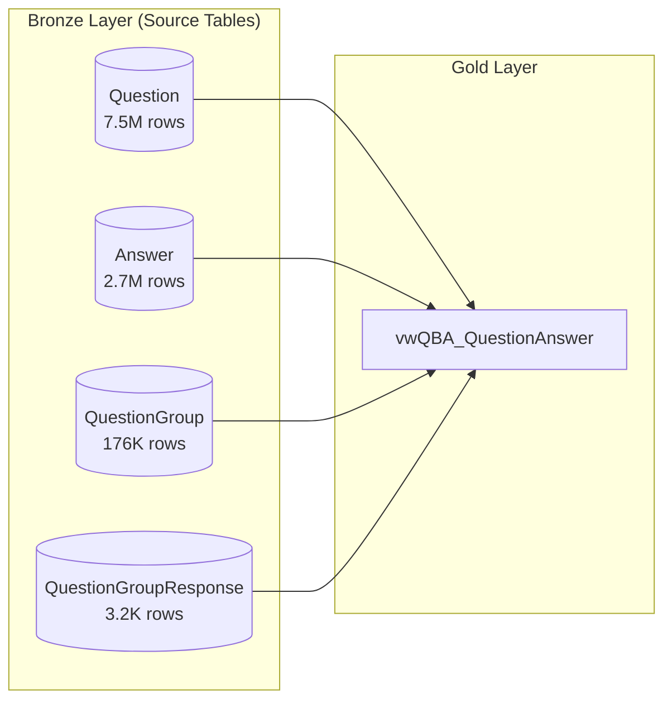
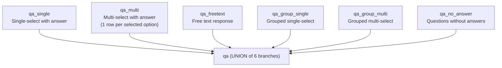
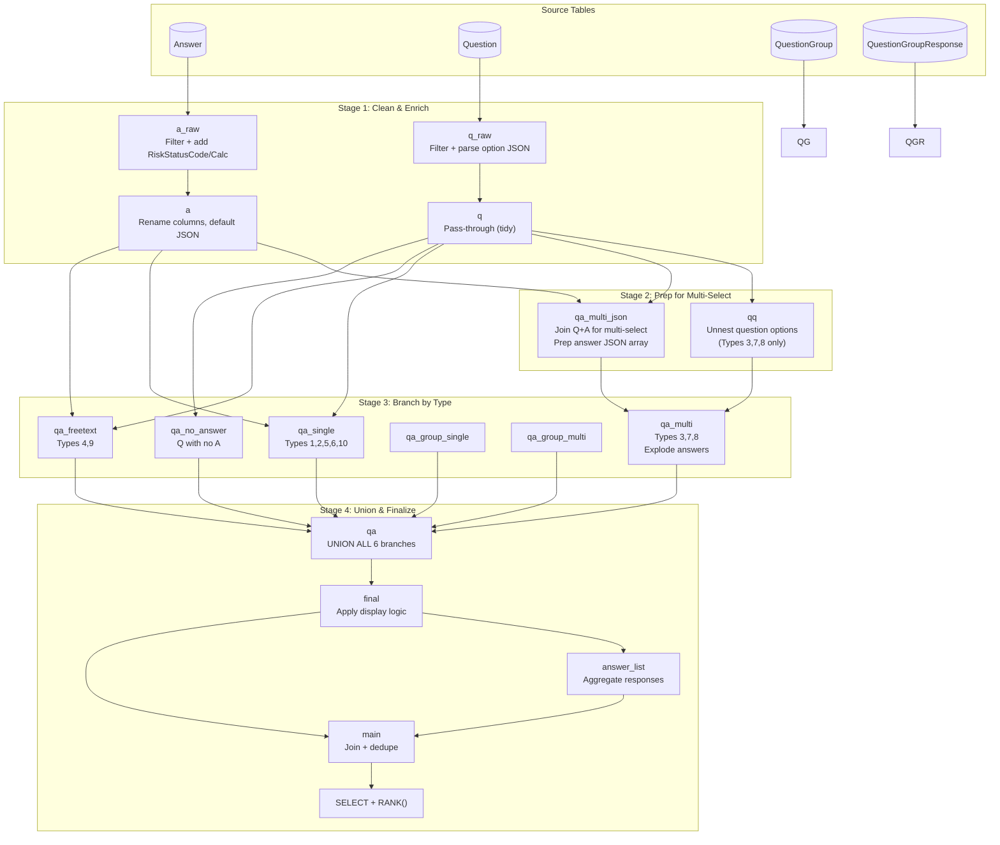
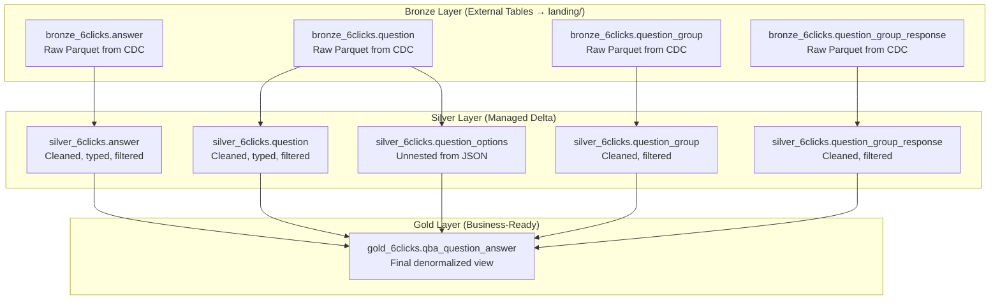

# vwQBA_QuestionAnswer — Data Lineage & Transformation Specification

> **Purpose:** Specification document for recreating `vwQBA_QuestionAnswer` as a Databricks materialized view using medallion architecture.  
> **Source of Truth:** `etc/vwQBA_QuestionAnswer DDL script.sql`  
> **Target:** Databricks Serverless SQL (AU region POC)

---

## 1. High-Level Overview

### What This View Does

`vwQBA_QuestionAnswer` creates a denormalized, analytics-ready dataset that joins Questions with their Answers for reporting in Yellowfin. It handles the complexity that arises from different question types requiring different answer parsing strategies.

**The Core Challenge:** The `ComponentStr` column in both `Question` and `Answer` tables contains JSON blobs, but the JSON structure varies based on `Question.Type`. A "Yes/No" question stores answers differently than a "Multiple Choice" question. The view normalizes all these variations into a consistent output schema.

### Source Tables



### Source Table Summary

| Table | Rows | Size | Columns | Key Columns for View |
|-------|------|------|---------|---------------------|
| **Answer** | 2.7M | 647 MB | 22 | `Id`, `QuestionId`, `ComponentStr` (JSON), `Status`, `RiskStatus`, `Compliance`, `Score`, `ResponderId` |
| **Question** | 7.5M | 13.5 GB | 37 | `Id`, `Type`, `ComponentStr` (JSON), `Weighting`, `AssessmentDomainId`, `QuestionGroupId`, `QuestionGroupResponseId` |
| **QuestionGroup** | 176K | 45 MB | 15 | `Id` (only used for join validation) |
| **QuestionGroupResponse** | 3.2K | 0.5 MB | 16 | `Id`, `IdRef`, `Response`, `Compliance`, `AssessmentResponseId` |

### Key Filters Applied at Source

| Table | Filter | Purpose |
|-------|--------|---------|
| Answer | `IsDeleted = 0 AND Status = 3` | Only non-deleted, submitted answers |
| Question | `IsDeleted = 0` | Only non-deleted questions |
| QuestionGroup | `IsDeleted = 0` | Only non-deleted groups |
| QuestionGroupResponse | `IsDeleted = 0` | Only non-deleted group responses |

---

## 2. Question Types & The 6-Way Branching Logic

The view handles **10 question types**, which are grouped into **3 processing categories** that ultimately produce **6 output branches** (unioned together at the end).

### Question Type Mapping

| Type Code | Type Name | Category | Processing Branch |
|-----------|-----------|----------|-------------------|
| 1 | Yes/No | Single-Select | `qa_single` |
| 2 | Custom | Single-Select | `qa_single` |
| 5 | Geography | Single-Select | `qa_single` |
| 6 | Industry | Single-Select | `qa_single` |
| 10 | Custom Radio | Single-Select | `qa_single` |
| 3 | Multiple Choice | Multi-Select | `qa_multi` |
| 7 | Multiple Choice Geography | Multi-Select | `qa_multi` |
| 8 | Multiple Choice Industry | Multi-Select | `qa_multi` |
| 4 | Text Response | Free Text | `qa_freetext` |
| 9 | Short Text Response | Free Text | `qa_freetext` |

### The 6 Branches (UNION)



### Branch Descriptions

| Branch | Condition | Row Multiplicity |
|--------|-----------|------------------|
| `qa_single` | `Type IN (1,2,5,6,10)` AND has answer | 1 row per answer |
| `qa_multi` | `Type IN (3,7,8)` AND has answer | 1 row **per selected option** |
| `qa_freetext` | `Type IN (4,9)` AND has answer | 1 row per answer |
| `qa_group_single` | Single-select within a QuestionGroup | 1 row per answer |
| `qa_group_multi` | Multi-select within a QuestionGroup | 1 row per selected option |
| `qa_no_answer` | Question exists but no matching Answer | 1 row per question |

**Key Insight:** Multi-select questions (types 3, 7, 8) explode into **multiple rows** — one per selected option. This is why `Answer_ResponseCount` is always 1 but there can be many rows per Answer.

---

## 3. JSON Parsing Logic

Both `Question.ComponentStr` and `Answer.ComponentStr` contain JSON blobs. The parsing strategy differs by question type.

### Question JSON Parsing (extracting answer options)

| Question Type | JSON Path | What It Contains |
|---------------|-----------|------------------|
| 2, 5, 6, 10 (Custom/Radio types) | `$.components.radiocustom.values` | Array of `{value, rank, riskStatus}` objects |
| 3, 7, 8 (Multi-select types) | `$.components.multiselect.values` | Array of `{value, rank, riskStatus}` objects |
| 1 (Yes/No) | N/A | Hard-coded options (Yes/No) |
| 4, 9 (Free text) | N/A | No options — free text input |

### Answer JSON Parsing (extracting user responses)

| Question Type | JSON Path | What It Extracts |
|---------------|-----------|------------------|
| 1 (Yes/No) | `$.Radio` | "Yes" or "No" string |
| 2, 5, 6, 10 (Custom/Radio) | `$.RadioCustom` | Selected option value |
| 3, 7, 8 (Multi-select) | `$.MultiSelectValues` | Array of selected values (exploded to rows) |
| 4, 9 (Free text) | `$.TextArea` | The text response |
| All types | `$.Submit` | Boolean indicating submission |
| All types | `$.TextArea` | Additional explanatory text (if any) |

### Example JSON Structures

**Answer.ComponentStr (single-select):**
```json
{
  "RadioCustom": "Option A",
  "Radio": null,
  "TextArea": "Additional notes here",
  "Submit": true,
  "MultiSelectValues": null,
  "Id": 12345
}
```

**Answer.ComponentStr (multi-select):**
```json
{
  "RadioCustom": null,
  "Radio": null,
  "TextArea": "",
  "Submit": true,
  "MultiSelectValues": ["Option A", "Option C", "Option D"],
  "Id": 12346
}
```

**Question.ComponentStr (option definitions):**
```json
{
  "components": {
    "radiocustom": {
      "values": [
        {"value": "Option A", "rank": 1, "riskStatus": 0},
        {"value": "Option B", "rank": 2, "riskStatus": 1},
        {"value": "Option C", "rank": 3, "riskStatus": 3}
      ]
    }
  }
}
```

### The `qq` CTE

For multi-select questions, the view unnests `Question.ComponentStr` to get **all possible options** with their `rank` and `riskStatus`. This is then joined to the selected answers to calculate scores.

---

## 4. CTE Flow & Data Lineage

### Full CTE Flow Diagram



### Stage Summary

| Stage | CTEs | Purpose |
|-------|------|---------|
| 1. Clean & Enrich | `a_raw`, `a`, `q_raw`, `q` | Filter deleted records, decode status codes, parse JSON structures |
| 2. Prep for Multi-Select | `qq`, `qa_multi_json` | Unnest question options to enable score calculation |
| 3. Branch by Type | `qa_single`, `qa_multi`, `qa_freetext`, `qa_group_single`, `qa_group_multi`, `qa_no_answer` | Route to appropriate processing logic |
| 4. Union & Finalize | `qa`, `final`, `answer_list`, `main` | Combine all branches, apply display rules, generate surrogate key |

### CTE Descriptions

| CTE | Input | Output | Key Transformation |
|-----|-------|--------|-------------------|
| `a_raw` | Answer table | Filtered answers | Filter `IsDeleted=0, Status=3`; add RiskStatusCode, RiskStatusCalc, ComplianceCode |
| `a` | `a_raw` | Renamed answers | Rename columns with `Answer_` prefix; default NULL ComponentStr to empty JSON |
| `q_raw` | Question table | Enriched questions | Filter `IsDeleted=0`; add TypeCode, IsMultiSelectType; extract option JSON |
| `q` | `q_raw` | Cleaned questions | Pass-through with consistent column naming |
| `qq` | `q` | Unnested options | OPENJSON to explode options array (Types 3,7,8 only) |
| `qa_multi_json` | `q` + `a` | Multi-select prep | Join Q+A for multi-select; wrap MultiSelectValues in JSON object |
| `qa_single` | `q` + `a` | Single-select answers | Extract RadioCustom/Radio value |
| `qa_multi` | `qa_multi_json` + `qq` | Exploded multi-select | OPENJSON to explode selected values; join to options for score |
| `qa_freetext` | `q` + `a` | Free text answers | Extract TextArea value |
| `qa_group_single` | `q` + `a` + `qg` + `qgr` | Grouped single-select | Use QuestionGroupResponse for compliance |
| `qa_group_multi` | `qa_multi_json` + `qq` + `qg` + `qgr` | Grouped multi-select | Combine group and multi-select logic |
| `qa_no_answer` | `q` LEFT JOIN `a` | Unanswered questions | Where Answer is NULL |
| `qa` | All 6 branches | Combined results | UNION of all branches with `part` label |
| `final` | `qa` | Display-ready | Apply conditional logic for display values |
| `answer_list` | `final` | Aggregated responses | STRING_AGG of responses per question |
| `main` | `final` + `answer_list` | Deduplicated | DISTINCT join with aggregated list |

---

## 5. Scoring & Risk Calculation Logic

### Risk Status Mapping

The raw `RiskStatus` integer is mapped to both a label and a numeric scale for aggregation:

| RiskStatus (raw) | RiskStatusCode (label) | RiskStatusCalc (numeric) |
|------------------|------------------------|--------------------------|
| 0 | No Risk | 0.0 |
| 6 | Very Low Risk | 1.0 |
| 1 | Low Risk | 2.0 |
| 3 | Medium Risk | 3.0 |
| 4 | High Risk | 4.0 |
| 5 | Very High Risk | 5.0 |
| NULL/other | Undefined | NULL |

### Score Calculation by Question Type

| Scenario | Answer_Score | Answer_MaxPossibleScore |
|----------|--------------|-------------------------|
| **Single-select** (1,2,5,6,10) | Stored directly in `Answer.Score` | Stored in `Answer.MaxPossibleScore` |
| **Multi-select** (3,7,8) | `Question.Weighting × Option.Rank` (per selected option) | `SUM(Weighting × Rank)` across all options |
| **Free text** (4,9) | NULL (not scored) | NULL |
| **No answer** | 0 | NULL |
| **Skip logic applied** | NULL | (preserved) |

### Compliance Mapping

| Compliance (raw) | ComplianceCode (label) |
|------------------|------------------------|
| 0 | None |
| 1 | Compliant |
| 2 | Not compliant |
| 3 | Partially compliant |
| other | Undefined |

### Question Status Logic

| Condition | Question_Status |
|-----------|-----------------|
| `HiddenInSurveyForConditional = 1` | "Skip Logic Applied" |
| `ResponderId IS NOT NULL` | "Responded" |
| `ResponderId IS NULL` | "Not Answered" |

### Display Value Logic (in `final` CTE)

The `final` CTE applies business rules to ensure display-friendly values:

| Column | Condition | Result |
|--------|-----------|--------|
| `AnswerResponse_Value` | Skip logic applied | 'Blank' |
| `AnswerResponse_Value` | Free text, NULL | 'Blank' |
| `AnswerResponse_Value` | Empty string | 'Blank' |
| `AnswerResponse_Value` | No answer | 'Not Responded' |
| `Answer_TextArea` | Skip logic applied | 'Blank because skip logic is applied' |
| `Answer_TextArea` | No responder | 'Blank because Question is not responded to' |
| `Answer_RiskStatusCode` | Skip logic applied | 'Skip Logic Applied' |
| `Answer_RiskStatusCode` | Free text | 'Not Risk Rated' |
| `Answer_RiskStatusCode` | No answer | 'Not Answered' |

---

## 6. Output Schema & Column-Level Lineage

The final view produces **36 columns**.

### Identifier & Metadata Columns

| Output Column | Source | Transformation |
|---------------|--------|----------------|
| `part` | Literal | Branch identifier: 'single', 'multi', 'freetext', 'group single', 'group multi', 'no answer' |
| `Answer_TenantId` | `Question.TenantId` | Renamed (uses Question's TenantId, not Answer's) |
| `Question_Id` | `Question.Id` | Direct |
| `Question_Order` | `Question.Order` | Direct |
| `Question_IdRef` | `Question.IdRef` or `QuestionGroupResponse.IdRef` | Group questions use QGR's IdRef |
| `Answer_Id` | `Answer.Id` | Direct (0 for no-answer) |
| `AnswerResponse_PK` | Computed | `{Answer_Id}_{key}` or `{Answer_Id}_{QGR_Id}_{key}` |
| `QBA_QuestionAnswer_pk` | Computed | `RANK() OVER (ORDER BY Question_Id, AnswerResponse_PK)` |

### Question Attribute Columns

| Output Column | Source | Transformation |
|---------------|--------|----------------|
| `Question_Name` | `Question.Name` | Cast to `nvarchar(4000)` |
| `Question_Description` | `Question.Description` | Direct |
| `Question_AssessmentDomainId` | `Question.AssessmentDomainId` | Direct |
| `Question_Type` | `Question.Type` | Direct (integer 1-10) |
| `Question_TypeCode` | `Question.Type` | CASE mapped to label |
| `Question_Weighting` | `Question.Weighting` | Direct |
| `Question_HasConditionalLogic` | `Question.HasConditionalLogic` | Direct |
| `Question_HiddenInSurveyForConditional` | `Question.HiddenInSurveyForConditional` | Direct |
| `Question_QuestionGroupId` | `Question.QuestionGroupId` | Direct |
| `Question_QuestionGroupResponseId` | `Question.QuestionGroupResponseId` | Direct |
| `Question_IsMandatory` | `Question.IsMandatory` | Direct |
| `Question_DisplayDocumentUpload` | `Question.DisplayDocumentUpload` | COALESCE with 0 |
| `Question_Status` | Computed | See Section 5 logic |

### Answer Metric Columns

| Output Column | Source | Transformation |
|---------------|--------|----------------|
| `Answer_Compliance` | `Answer.Compliance` or `QuestionGroupResponse.Compliance` | Direct (0 for no-answer) |
| `Answer_ComplianceCode` | Computed | CASE map: 0→None, 1→Compliant, 2→Not compliant, 3→Partially compliant |
| `Answer_ResponseCount` | Literal | Always 1 (even multi-select rows) or 0 for no-answer |
| `Answer_MaxPossibleScore` | `Answer.MaxPossibleScore` or computed | Multi-select: SUM of all option ranks × weighting |
| `Answer_Score` | `Answer.Score` or computed | NULL if skip-logic/freetext; 0 if no-answer; computed for multi-select |
| `Answer_RiskStatus` | `Answer.RiskStatus` or option's `riskStatus` | NULL if skip-logic/freetext; 0 if no-answer |
| `Answer_RiskStatusCode` | Computed | Label with special values: 'Skip Logic Applied', 'Not Risk Rated', 'Not Answered' |
| `Answer_RiskStatusCalc` | Computed | Numeric 0-5 scale; NULL if skip-logic/freetext; 0.00 if no-answer |
| `Answer_ResponderId` | `Answer.ResponderId` | Direct (NULL for no-answer) |
| `Answer_AssessmentResponseId` | `Answer.AssessmentResponseId` or `QGR.AssessmentResponseId` | Direct |
| `Answer_ReviewerComment` | `Answer.ReviewerComment` | Direct |

### Response Value Columns

| Output Column | Source | Transformation |
|---------------|--------|----------------|
| `AnswerResponse_key` | Computed | Array index + 1 for multi-select; 0 or 1 otherwise |
| `AnswerResponse_Value` | JSON parsed | See Section 3; 'Blank' if empty/NULL/skip-logic; 'Not Responded' for no-answer |
| `Answer_TextArea` | `Answer.ComponentStr → $.TextArea` | Explanatory text; special messages for skip-logic/no-answer |
| `AnswerResponseValue_List` | Computed | `STRING_AGG(AnswerResponse_Value, ', ')` grouped by Question |

### Timestamp Column

| Output Column | Source | Transformation |
|---------------|--------|----------------|
| `QBA_QA_UpdateTime` | `Answer.LastModificationTime`, `Question.LastModificationTime` | `CASE WHEN Answer >= Question THEN Answer ELSE Question END` |

---

## 7. Medallion Architecture Mapping

### Layer Diagram



### Silver Layer Transformations

| Silver Table | Source | Key Transformations |
|--------------|--------|---------------------|
| `silver_6clicks.answer` | Bronze answer | Filter `IsDeleted=0, Status=3`; add `RiskStatusCode`, `RiskStatusCalc`, `ComplianceCode`; parse `ComponentStr` into typed columns |
| `silver_6clicks.question` | Bronze question | Filter `IsDeleted=0`; add `TypeCode`, `IsMultiSelectType`; cast `Name` to bounded varchar |
| `silver_6clicks.question_options` | Bronze question | **New table**: Unnest `ComponentStr` JSON into rows with `question_id`, `option_value`, `option_rank`, `option_risk_status` |
| `silver_6clicks.question_group` | Bronze question_group | Filter `IsDeleted=0` |
| `silver_6clicks.question_group_response` | Bronze question_group_response | Filter `IsDeleted=0` |

**Key Design Decision:** The `question_options` table in Silver explodes the JSON once, avoiding repeated JSON parsing in Gold. This is the `qq` CTE materialized.

### Gold Layer Implementation

**Approach:** Single materialized view that mirrors the current DDL structure.

- One large SQL statement with all CTEs inlined
- Pros: Simpler to maintain, direct port from DDL
- Cons: Harder to debug, all-or-nothing refresh

---

## 8. T-SQL to Databricks SQL Translation Notes

| T-SQL Construct | Databricks SQL Equivalent |
|-----------------|---------------------------|
| `OUTER APPLY OPENJSON(json, '$.path')` | `LATERAL VIEW EXPLODE(FROM_JSON(json, schema))` |
| `JSON_VALUE(json, '$.path')` | `GET_JSON_OBJECT(json, '$.path')` or `json:path` |
| `JSON_QUERY(json, '$.path')` | `GET_JSON_OBJECT(json, '$.path')` |
| `json_modify(json, 'append $', value)` | `CONCAT(SUBSTRING(json, 1, LENGTH(json)-1), ',', value, ']')` or use arrays |
| `STRING_AGG(col, ', ')` | `CONCAT_WS(', ', COLLECT_LIST(col))` |
| `CAST(x AS nvarchar(4000))` | `CAST(x AS STRING)` |
| `CAST(x AS smalldatetime)` | `CAST(x AS TIMESTAMP)` |
| `CAST(x AS decimal(15,2))` | `CAST(x AS DECIMAL(15,2))` |
| `COALESCE(a, b)` | `COALESCE(a, b)` (same) |
| `RANK() OVER (ORDER BY ...)` | `RANK() OVER (ORDER BY ...)` (same) |
| `CONCAT(a, '_', b)` | `CONCAT(a, '_', b)` (same) |
| `LEN(x)` | `LENGTH(x)` |

---

## 9. Implementation Roadmap

```mermaid
flowchart LR
    subgraph Phase1["Phase 1: Infrastructure"]
        P1A[Set up Bronze external tables]
        P1B[Configure CDC pipeline]
    end
    
    subgraph Phase2["Phase 2: Silver Layer"]
        P2A[Create silver.answer]
        P2B[Create silver.question]
        P2C[Create silver.question_options]
        P2D[Create silver.question_group*]
    end
    
    subgraph Phase3["Phase 3: Gold Layer"]
        P3A[Port DDL to Databricks SQL]
        P3B[Validate against Synapse output]
    end
    
    subgraph Phase4["Phase 4: Serve"]
        P4[Connect Yellowfin]
    end
    
    Phase1 --> Phase2 --> Phase3 --> Phase4
```



### Validation Strategy

1. Run both Synapse view and Databricks view on same data snapshot
2. Compare row counts by `part` (branch)
3. Compare aggregate metrics (SUM of scores, COUNT by RiskStatusCode)
4. Spot-check individual Question_Id values for column-level accuracy

---

## Appendix A: Source Table Schemas

### Answer (22 columns)

```sql
CREATE TABLE Answer (
    Id int PRIMARY KEY,
    AssessmentResponseId bigint NOT NULL,
    QuestionId int NULL,
    TenantId int NOT NULL,
    Status int NOT NULL,                    -- Filter: = 3
    RiskStatus int NOT NULL,
    Compliance int NOT NULL,
    MaxPossibleScore decimal(18,2) NULL,
    Score decimal(18,2) NULL,
    ResponderId bigint NULL,
    ReviewerComment nvarchar(MAX) NULL,
    HaileySuggestedAnswerStatus int NULL,
    ComponentStr nvarchar(MAX) NULL,        -- JSON blob
    CreationTime datetime2 NOT NULL,
    CreatorUserId bigint NULL,
    LastModificationTime datetime2 NULL,
    LastModifierUserId bigint NULL,
    IsDeleted bit NOT NULL,                 -- Filter: = 0
    DeleterUserId bigint NULL,
    DeletionTime datetime2 NULL,
    Uuid uniqueidentifier NOT NULL,
    HaileySuggestedComponentStr nvarchar(MAX) NULL
);
```

### Question (37 columns)

```sql
CREATE TABLE Question (
    Id int PRIMARY KEY,
    ComponentStr nvarchar(MAX) NULL,        -- JSON blob with options
    Code nvarchar(MAX) NULL,
    Name nvarchar(MAX) NULL,
    Description nvarchar(MAX) NULL,
    [Order] int NOT NULL,
    Suborder nvarchar(MAX) NULL,
    [File] varbinary(MAX) NULL,
    [Type] int NOT NULL,                    -- 1-10, determines processing branch
    IdRef nvarchar(MAX) NULL,
    AssessmentDomainId int NOT NULL,
    VendorDocumentRequired bit NOT NULL,
    Weighting float NOT NULL,
    TenantId int NOT NULL,
    RiskStatus int NOT NULL,
    HasConditionalLogic bit NOT NULL,
    IsVisibleIfConditional bit NOT NULL,
    [Condition] int NULL,
    HiddenInSurveyForConditional bit NOT NULL,
    DisplayDocumentUpload bit NOT NULL,
    QuestionGroupId int NULL,
    RootQuestionId int NULL,
    ParentQuestionId int NULL,
    IsMandatory bit NOT NULL,
    IsTemplate bit NOT NULL,
    CreatedFromQuestionId int NULL,
    QuestionGroupResponseId int NULL,
    IsActive bit NULL,
    CreationTime datetime2 NOT NULL,
    CreatorUserId bigint NULL,
    LastModificationTime datetime2 NULL,
    LastModifierUserId bigint NULL,
    IsDeleted bit NOT NULL,                 -- Filter: = 0
    DeleterUserId bigint NULL,
    DeletionTime datetime2 NULL,
    IsMultiSelectType AS (CASE WHEN Type IN (3,7,8) THEN 1 ELSE 0 END),  -- Computed
    Uuid uniqueidentifier NOT NULL
);
```

### QuestionGroup (15 columns)

```sql
CREATE TABLE QuestionGroup (
    Id int PRIMARY KEY,
    Name nvarchar(MAX) NULL,
    Description nvarchar(MAX) NULL,
    TenantId int NOT NULL,
    Explanation nvarchar(MAX) NULL,
    [Type] int NOT NULL,
    Compliance int NOT NULL,
    Code nvarchar(MAX) NULL,
    CreationTime datetime2 NOT NULL,
    CreatorUserId bigint NULL,
    LastModificationTime datetime2 NULL,
    LastModifierUserId bigint NULL,
    IsDeleted bit NOT NULL,                 -- Filter: = 0
    DeleterUserId bigint NULL,
    DeletionTime datetime2 NULL
);
```

### QuestionGroupResponse (16 columns)

```sql
CREATE TABLE QuestionGroupResponse (
    Id int PRIMARY KEY,
    TenantId int NOT NULL,
    Response nvarchar(MAX) NULL,
    QuestionGroupId int NOT NULL,
    AssessmentResponseId bigint NOT NULL,
    [Order] nvarchar(MAX) NULL,
    IdRef nvarchar(MAX) NULL,
    Compliance int NOT NULL,
    Code nvarchar(MAX) NULL,
    CreationTime datetime2 NOT NULL,
    CreatorUserId bigint NULL,
    LastModificationTime datetime2 NULL,
    LastModifierUserId bigint NULL,
    IsDeleted bit NOT NULL,                 -- Filter: = 0
    DeleterUserId bigint NULL,
    DeletionTime datetime2 NULL
);
```

---

*Document generated: January 2026*  
*Source: `etc/vwQBA_QuestionAnswer DDL script.sql`*

